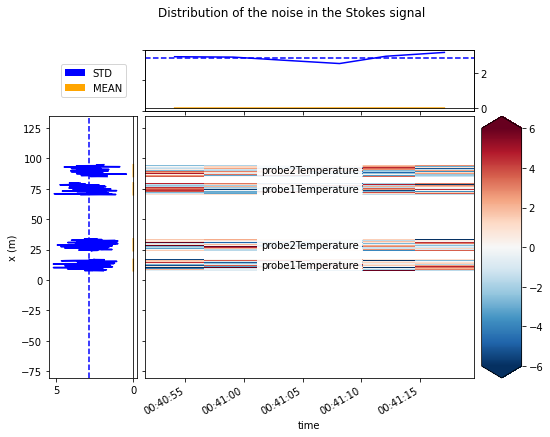
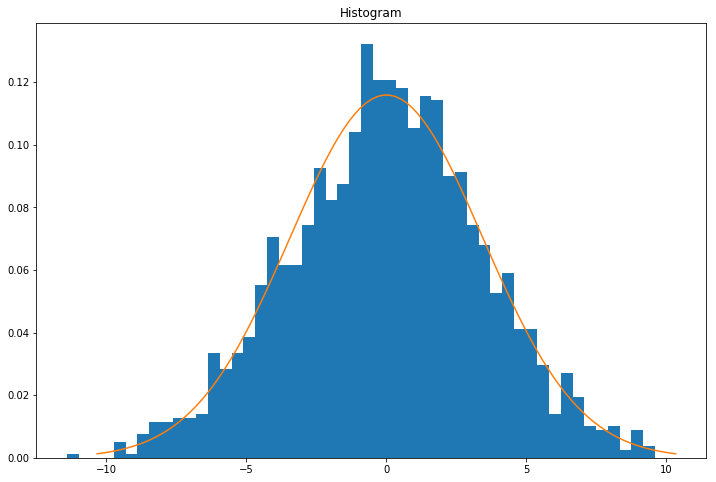

4. Calculate variance of Stokes and anti-Stokes measurements
============================================================

The goal of this notebook is to estimate the variance of the noise of
the Stokes measurement. The measured Stokes and anti-Stokes signals
contain noise that is distributed approximately normal. We need to
estimate the variance of the noise to: - Perform a weighted calibration
- Construct confidence intervals

.. code:: ipython3

    import os
    import warnings
    
    warnings.simplefilter('ignore')  # Hide warnings to avoid clutter in the notebook
    
    from dtscalibration import read_silixa_files
    from matplotlib import pyplot as plt
    %matplotlib inline

.. code:: ipython3

    filepath = os.path.join('..', '..', 'tests', 'data', 'double_ended2')
    
    ds = read_silixa_files(
        directory=filepath,
        timezone_netcdf='UTC',
        file_ext='*.xml')

.. parsed-literal::

    6 files were found, each representing a single timestep
    6 recorded vars were found: LAF, ST, AST, REV-ST, REV-AST, TMP
    Recorded at 1693 points along the cable
    The measurement is double ended
    Reading the data from disk

And we define the sections as we learned from the previous notebook.
Sections are required to calculate the variance in the Stokes.

.. code:: ipython3

    sections = {
        'probe1Temperature': [slice(7.5, 17.), slice(70., 80.)],  # cold bath
        'probe2Temperature': [slice(24., 34.), slice(85., 95.)],  # warm bath
        }
    ds.sections = sections

The variance in the Stokes signal will vary along the length of the
fiber. There are multiple ways to approach this, each has its own pros
and cons. **It is important to consider which model you use for your
setup, as this will impact the calibration weights and predicted
uncertainty.**

-  In small setups with small variations in Stokes intensity,
   ``ds.variance_stokes_constant`` can be used. This function determines
   a single (constant) value for the variance. This method is not
   recommended for larger setups (e.g., >300 m) due to the signal
   strength dependency of the variance.

-  For larger setups ``ds.variance_stokes_linear`` should be used. This
   function assumes a linear relationship between the Stokes signal
   strength and variance. Tests on Silixa and Sensornet devices indicate
   this relationship is linear, and (approximately) goes through the
   origin; i.e. at 0 Stokes intensity, the signal variance is very close
   to 0.

-  ``variance_stokes_exponential`` can be used for small setups with
   very few time steps. Too many degrees of freedom results in an under
   estimation of the noise variance. Almost never the case, but use when
   calibrating e.g. a single time step.

As the setup we are using is only 100 m in length, we can use
``ds.variance_stokes_constant``

.. code:: ipython3

    I_var, residuals = ds.variance_stokes_constant(st_label='st')
    print("The variance of the Stokes signal along the reference sections "
          "is approximately {:.2f} on a {:.1f} sec acquisition time".format(I_var, ds.userAcquisitionTimeFW.data[0]))

.. parsed-literal::

    The variance of the Stokes signal along the reference sections is approximately 8.18 on a 2.0 sec acquisition time

.. code:: ipython3

    from dtscalibration import plot
    
    fig_handle = plot.plot_residuals_reference_sections(
            residuals,
            sections,
            title='Distribution of the noise in the Stokes signal',
            plot_avg_std=I_var ** 0.5,
            plot_names=True,
            robust=True,
            units='',
            method='single')

The residuals should be normally distributed and independent from
previous time steps and other points along the cable. If you observe
patterns in the residuals plot (above), it might be caused by: - The
temperature in the calibration bath is not uniform - Attenuation caused
by coils/sharp bends in cable - Attenuation caused by a splice

.. code:: ipython3

    import scipy
    import numpy as np
    
    sigma = residuals.std()
    mean = residuals.mean()
    x = np.linspace(mean - 3*sigma, mean + 3*sigma, 100)
    approximated_normal_fit = scipy.stats.norm.pdf(x, mean, sigma)
    residuals.plot.hist(bins=50, figsize=(12, 8), density=True)
    plt.plot(x, approximated_normal_fit);

We can follow the same steps to calculate the variance from the noise in
the anti-Stokes measurments by setting ``st_label='ast`` and redoing the
steps.
