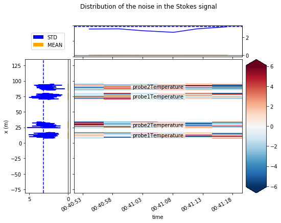

4. Calculate variance of Stokes and anti-Stokes measurements
============================================================

The goal of this notebook is to estimate the variance of the noise of
the Stokes measurement. The measured Stokes and anti-Stokes signals
contain noise that is distributed approximately normal. We need to
estimate the variance of the noise to: - Perform a weighted calibration
- Construct confidence intervals

.. code:: ipython3

    import os
    
    from dtscalibration import read_silixa_files
    from matplotlib import pyplot as plt
    
    %matplotlib inline

.. code:: ipython3

    filepath = os.path.join('..', '..', 'tests', 'data', 'double_ended2')
    
    ds = read_silixa_files(
        directory=filepath,
        timezone_netcdf='UTC',
        file_ext='*.xml')

.. parsed-literal::

    6 files were found, each representing a single timestep
    6 recorded vars were found: LAF, ST, AST, REV-ST, REV-AST, TMP
    Recorded at 1693 points along the cable
    The measurement is double ended
    Reading the data from disk

And we define the sections as we learned from the previous notebook.
Sections are required to calculate the variance in the Stokes.

.. code:: ipython3

    sections = {
        'probe1Temperature': [slice(7.5, 17.), slice(70., 80.)],  # cold bath
        'probe2Temperature': [slice(24., 34.), slice(85., 95.)],  # warm bath
        }
    ds.sections = sections

Lets first read the documentation about the ``ds.variance_stokes``
method.

.. code:: ipython3

    print(ds.variance_stokes.__doc__) 

.. parsed-literal::

    Calculates the variance between the measurements and a best fit
            at each reference section. This fits a function to the nt * nx
            measurements with ns * nt + nx parameters, where nx are the total
            number of obervation locations along all sections. The temperature is
            constant along the reference sections, so the expression of the
            Stokes power can be split in a time series per reference section and
            a constant per observation location.
    
            Assumptions: 1) the temperature is the same along a reference
            section.
    
            Idea from discussion at page 127 in Richter, P. H. (1995). Estimating
            errors in least-squares fitting.
    
            Parameters
            ----------
            reshape_residuals
            st_label : str
                label of the Stokes, anti-Stokes measurement.
                E.g., ST, AST, REV-ST, REV-AST
            sections : dict, optional
                Define sections. See documentation
    
            Returns
            -------
            I_var : float
                Variance of the residuals between measured and best fit
            resid : array_like
                Residuals between measured and best fit
    
            Notes
            -----
            Because there are a large number of unknowns, spend time on
            calculating an initial estimate. Can be turned off by setting to False.
            

.. code:: ipython3

    I_var, residuals = ds.variance_stokes(st_label='ST')
    print("The variance of the Stokes signal along the reference sections "
          "is approximately {} on a {} sec acquisition time".format(I_var, ds.userAcquisitionTimeFW.data[0]))

.. parsed-literal::

    The variance of the Stokes signal along the reference sections is approximately 8.181920419777416 on a 2.0 sec acquisition time

.. code:: ipython3

    from dtscalibration import plot
    
    fig_handle = plot.plot_residuals_reference_sections(
            residuals,
            sections,
            title='Distribution of the noise in the Stokes signal',
            plot_avg_std=I_var ** 0.5,
            plot_names=True,
            robust=True,
            units='',
            method='single')

.. parsed-literal::

    /Users/bfdestombe/Projects/dts-calibration/python-dts-calibration-dev/src/dtscalibration/plot.py:300: FutureWarning: Conversion of the second argument of issubdtype from `float` to `np.floating` is deprecated. In future, it will be treated as `np.float64 == np.dtype(float).type`.
      if (np.issubdtype(resid[time_dim].dtype, np.float) or
    /Users/bfdestombe/Projects/dts-calibration/python-dts-calibration-dev/src/dtscalibration/plot.py:301: FutureWarning: Conversion of the second argument of issubdtype from `int` to `np.signedinteger` is deprecated. In future, it will be treated as `np.int64 == np.dtype(int).type`.
      np.issubdtype(resid[time_dim].dtype, np.int)):
    /Users/bfdestombe/Projects/dts-calibration/python-dts-calibration-dev/.tox/docs/lib/python3.7/site-packages/numpy/lib/nanfunctions.py:1666: RuntimeWarning: Degrees of freedom <= 0 for slice.
      keepdims=keepdims)
    /Users/bfdestombe/Projects/dts-calibration/python-dts-calibration-dev/.tox/docs/lib/python3.7/site-packages/xarray/core/nanops.py:140: RuntimeWarning: Mean of empty slice
      return np.nanmean(a, axis=axis, dtype=dtype)

The residuals should be normally distributed and independent from
previous time steps and other points along the cable. If you observe
patterns in the residuals plot (above), it might be caused by: - The
temperature in the calibration bath is not uniform - Attenuation caused
by coils/sharp bends in cable - Attenuation caused by a splice

.. code:: ipython3

    import scipy
    import numpy as np
    
    sigma = residuals.std()
    mean = residuals.mean()
    x = np.linspace(mean - 3*sigma, mean + 3*sigma, 100)
    approximated_normal_fit = scipy.stats.norm.pdf(x, mean, sigma)
    residuals.plot.hist(bins=50, figsize=(12, 8), density=True)
    plt.plot(x, approximated_normal_fit);

.. image:: 04Calculate_variance_Stokes.ipynb_files/04Calculate_variance_Stokes.ipynb_11_0.png

We can follow the same steps to calculate the variance from the noise in
the anti-Stokes measurments by setting ``st_label='AST`` and redo the
steps.

