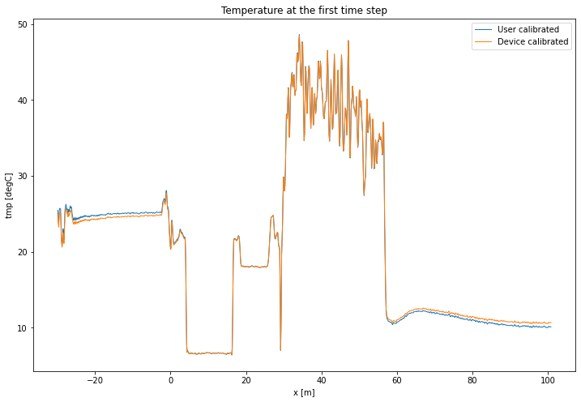

5. Calibration of double ended measurement with OLS
===================================================

A double ended calibration is performed with ordinary least squares.
Over all timesteps simultaneous. :math:`\gamma` and :math:`\alpha`
remain constant, while :math:`C` varies over time. The weights are
considered equal here and no variance or confidence interval is
calculated.

.. code:: ipython3

    import os
    
    from dtscalibration import read_silixa_files
    import matplotlib.pyplot as plt
    
    %matplotlib inline

.. code:: ipython3

    try:
        wd = os.path.dirname(os.path.realpath(__file__))
    except:
        wd = os.getcwd()
    
    filepath = os.path.join(wd, '..', '..', 'tests', 'data', 'single_ended')
    timezone_netcdf = 'UTC',
    timezone_ultima_xml = 'Europe/Amsterdam'
    file_ext = '*.xml'
    
    ds = read_silixa_files(
        directory=filepath,
        timezone_netcdf=timezone_netcdf,
        timezone_ultima_xml=timezone_ultima_xml,
        file_ext=file_ext)
    
    ds100 = ds.sel(x=slice(-30, 101))  # only calibrate parts of the fiber
    sections = {
                'probe1Temperature':    [slice(20, 25.5)],  # warm bath
                'probe2Temperature':    [slice(5.5, 15.5)],  # cold bath
    #             'referenceTemperature': [slice(-24., -4)]  # The internal coil is not so uniform
                }

.. parsed-literal::

    3 files were found, each representing a single timestep
    4 recorded vars were found: LAF, ST, AST, TMP
    Recorded at 1461 points along the cable
    The measurement is single ended

.. code:: ipython3

    print(ds100.calibration_single_ended.__doc__)

.. parsed-literal::

    
    
            Parameters
            ----------
            sections : dict, optional
            st_label : str
                Label of the forward stokes measurement
            ast_label : str
                Label of the anti-Stoke measurement
            st_var : float, optional
                The variance of the measurement noise of the Stokes signals in the forward
                direction Required if method is wls.
            ast_var : float, optional
                The variance of the measurement noise of the anti-Stokes signals in the forward
                direction. Required if method is wls.
            store_c : str
                Label of where to store C
            store_gamma : str
                Label of where to store gamma
            store_dalpha : str
                Label of where to store dalpha; the spatial derivative  of alpha.
            store_alpha : str
                Label of where to store alpha; The integrated differential attenuation.
                alpha(x=0) = 0
            store_tmpf : str
                Label of where to store the calibrated temperature of the forward direction
            variance_suffix : str, optional
                String appended for storing the variance. Only used when method is wls.
            method : {'ols', 'wls'}
                Use 'ols' for ordinary least squares and 'wls' for weighted least squares
            store_tempvar : str
                If defined, the variance of the error is calculated
            conf_ints : iterable object of float, optional
                A list with the confidence boundaries that are calculated. E.g., to cal
            conf_ints_size : int, optional
                Size of the monte carlo parameter set used to calculate the confidence interval
            ci_avg_time_flag : bool, optional
                The confidence intervals differ per time step. If you would like to calculate confidence
                intervals of all time steps together. ‘We can say with 95% confidence that the
                temperature remained between this line and this line during the entire measurement
                period’.
            da_random_state : dask.array.random.RandomState
                The seed for dask. Makes random not so random. To produce reproducable results for
                testing environments.
            solver : {'sparse', 'stats'}
                Either use the homemade weighted sparse solver or the weighted dense matrix solver of
                statsmodels
    
            Returns
            -------
    
            

.. code:: ipython3

    st_label = 'ST'
    ast_label = 'AST'
    ds100.calibration_single_ended(sections=sections,
                                   st_label=st_label,
                                   ast_label=ast_label,
                                   method='ols')

.. parsed-literal::

     
    LSQR            Least-squares solution of  Ax = b
    The matrix A has      366 rows  and        5 cols
    damp = 0.00000000000000e+00   calc_var =        1
    atol = 1.00e-08                 conlim = 1.00e+08
    btol = 1.00e-08               iter_lim =       10
     
       Itn      x[0]       r1norm     r2norm   Compatible    LS      Norm A   Cond A
         0  4.82000e+02   2.948e+01  2.948e+01    1.0e+00  1.0e+01
         1  4.82000e+02   6.004e-01  6.004e-01    1.4e-01  1.4e-02   3.1e+02  1.0e+00
         2  4.81999e+02   1.868e-02  1.868e-02    4.4e-03  3.4e-02   3.1e+02  7.1e+01
         3  4.81999e+02   6.248e-03  6.248e-03    1.5e-03  2.7e-05   3.1e+02  7.6e+01
         4  4.81999e+02   6.248e-03  6.248e-03    1.5e-03  1.2e-08   4.4e+02  1.1e+02
         5  4.81877e+02   6.248e-03  6.248e-03    1.5e-03  1.5e-08   4.4e+02  8.6e+05
         6  4.81877e+02   6.248e-03  6.248e-03    1.5e-03  1.1e-08   5.0e+02  9.8e+05
         7  4.81877e+02   6.248e-03  6.248e-03    1.5e-03  8.0e-09   5.3e+02  1.1e+06
     
    LSQR finished
    The least-squares solution is good enough, given atol     
     
    istop =       2   r1norm = 6.2e-03   anorm = 5.3e+02   arnorm = 2.7e-08
    itn   =       7   r2norm = 6.2e-03   acond = 1.1e+06   xnorm  = 2.1e-01
     

Lets compare our calibrated values with the device calibration

.. code:: ipython3

    ds1 = ds100.isel(time=0)  # take only the first timestep
    
    ds1.TMPF.plot(linewidth=1, label='User calibrated')  # plot the temperature calibrated by us
    ds1.TMP.plot(linewidth=1, label='Device calibrated')  # plot the temperature calibrated by the device
    plt.title('Temperature at the first time step')
    plt.legend()

.. parsed-literal::

    <matplotlib.legend.Legend at 0x11afc0b70>

