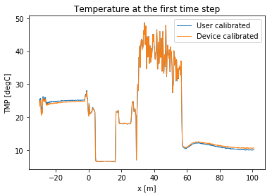
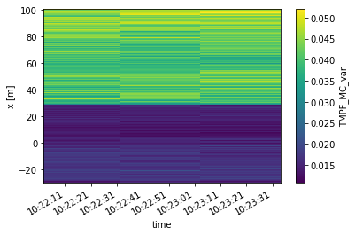
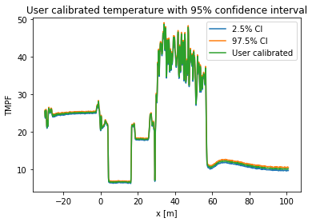
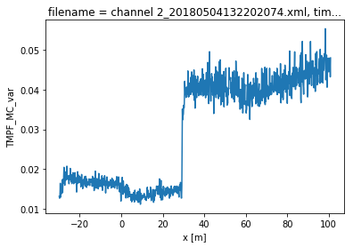
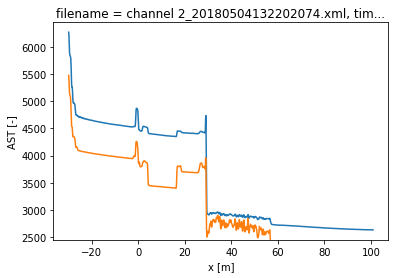

5. Calibration of single ended measurement with WLS and confidence intervals
============================================================================

A single ended calibration is performed with weighted least squares.
Over all timesteps simultaneous. :math:`\gamma` and :math:`\alpha`
remain constant, while :math:`C` varies over time. The weights are not
considered equal here. The weights kwadratically decrease with the
signal strength of the measured Stokes and anti-Stokes signals.

The confidence intervals can be calculated as the weights are correctly
defined.

.. code:: ipython3

    import os
    
    from dtscalibration import read_xml_dir
    import matplotlib.pyplot as plt
    %matplotlib inline

.. code:: ipython3

    try:
        wd = os.path.dirname(os.path.realpath(__file__))
    except:
        wd = os.getcwd()
    
    filepath = os.path.join(wd, '..', '..', 'tests', 'data', 'single_ended')
    timezone_netcdf = 'UTC',
    timezone_ultima_xml = 'Europe/Amsterdam'
    file_ext = '*.xml'
    
    ds = read_xml_dir(filepath,
                      timezone_netcdf=timezone_netcdf,
                      timezone_ultima_xml=timezone_ultima_xml,
                      file_ext=file_ext)
    
    ds = ds.sel(x=slice(-30, 101))  # only calibrate parts of the fiber
    sections = {
                'probe1Temperature':    [slice(20, 25.5)],  # warm bath
                'probe2Temperature':    [slice(5.5, 15.5)],  # cold bath
    #             'referenceTemperature': [slice(-24., -4)]  # The internal coil is not so uniform
                }
    ds.sections = sections

.. parsed-literal::

    3 files were found, each representing a single timestep
    4 recorded vars were found: LAF, ST, AST, TMP
    Recorded at 1461 points along the cable
    Dask: Setting up handle for delayed readout. 1 out of 3
    Dask: Setting up handle for delayed readout. 3 out of 3
    Directly reading time and extra info from xml files. 1 out of 3
    Directly reading time and extra info from xml files. 3 out of 3

.. code:: ipython3

    print(ds.calibration_single_ended.__doc__)

.. parsed-literal::

    
    
            Parameters
            ----------
            sections : dict, optional
            st_label : str
                Label of the forward stokes measurement
            ast_label : str
                Label of the anti-Stoke measurement
            st_var : float, optional
                The variance of the measurement noise of the Stokes signals in the forward
                direction Required if method is wls.
            ast_var : float, optional
                The variance of the measurement noise of the anti-Stokes signals in the forward
                direction. Required if method is wls.
            store_c : str
                Label of where to store C
            store_gamma : str
                Label of where to store gamma
            store_dalpha : str
                Label of where to store dalpha; the spatial derivative  of alpha.
            store_alpha : str
                Label of where to store alpha; The integrated differential attenuation.
                alpha(x=0) = 0
            store_tmpf : str
                Label of where to store the calibrated temperature of the forward direction
            variance_suffix : str, optional
                String appended for storing the variance. Only used when method is wls.
            method : {'ols', 'wls'}
                Use 'ols' for ordinary least squares and 'wls' for weighted least squares
            store_tempvar : str
                If defined, the variance of the error is calculated
            conf_ints : iterable object of float, optional
                A list with the confidence boundaries that are calculated. E.g., to cal
            conf_ints_size : int, optional
                Size of the monte carlo parameter set used to calculate the confidence interval
            ci_avg_time_flag : bool, optional
                The confidence intervals differ per time step. If you would like to calculate confidence
                intervals of all time steps together. ‘We can say with 95% confidence that the
                temperature remained between this line and this line during the entire measurement
                period’.
            da_random_state : dask.array.random.RandomState
                The seed for dask. Makes random not so random. To produce reproducable results for
                testing environments.
            solver : {'sparse', 'stats'}
                Either use the homemade weighted sparse solver or the weighted dense matrix solver of
                statsmodels
    
            Returns
            -------
    
            

.. code:: ipython3

    ds.data_vars

.. parsed-literal::

    Data variables:
        ST                     (x, time) float32 dask.array<shape=(1030, 3), chunksize=(1030, 1)>
        AST                    (x, time) float32 dask.array<shape=(1030, 3), chunksize=(1030, 1)>
        TMP                    (x, time) float32 dask.array<shape=(1030, 3), chunksize=(1030, 1)>
        acquisitionTime        (time) float64 30.71 30.7 30.72
        referenceTemperature   (time) float64 24.52 24.52 24.51
        probe1Temperature      (time) float64 18.02 18.02 18.02
        probe2Temperature      (time) float64 6.62 6.617 6.617
        referenceProbeVoltage  (time) float64 0.1232 0.1232 0.1232
        probe1Voltage          (time) float64 0.12 0.12 0.12
        probe2Voltage          (time) float64 0.115 0.115 0.115
        userAcquisitionTimeFW  (time) float64 30.0 30.0 30.0

.. code:: ipython3

    st_label = 'ST'
    ast_label = 'AST'

First calculate the variance in the measured Stokes and anti-Stokes
signals, in the forward and backward direction.

The Stokes and anti-Stokes signals should follow a smooth decaying
exponential. This function fits a decaying exponential to each reference
section for each time step. The variance of the residuals between the
measured Stokes and anti-Stokes signals and the fitted signals is used
as an estimate of the variance in measured signals.

.. code:: ipython3

    st_var, resid = ds.variance_stokes(st_label=st_label, suppress_info=1)
    ast_var, _ = ds.variance_stokes(st_label=ast_label, suppress_info=1)

Similar to the ols procedure, we make a single function call to
calibrate the temperature. If the method is ``wls`` and confidence
intervals are passed to ``conf_ints``, confidence intervals calculated.
As weigths are correctly passed to the least squares procedure, the
covariance matrix can be used. This matrix holds the covariances between
all the parameters. A large parameter set is generated from this matrix,
assuming the parameter space is normally distributed with their mean at
the best estimate of the least squares procedure.

The large parameter set is used to calculate a large set of
temperatures. By using ``percentiles`` or ``quantile`` the 95%
confidence interval of the calibrated temperature between 2.5% and 97.5%
are calculated.

The confidence intervals differ per time step. If you would like to
calculate confidence intervals of all time steps together you have the
option ``ci_avg_time_flag=True``. ‘We can say with 95% confidence that
the temperature remained between this line and this line during the
entire measurement period’.

.. code:: ipython3

    ds.calibration_single_ended(sections=sections,
                                st_label=st_label,
                                ast_label=ast_label,
                                st_var=st_var,
                                ast_var=ast_var,
                                method='wls',
                                # conf_ints=[0.00135, 0.025, 0.15865, 0.5, 0.84135, 0.975, 0.99865],
                                conf_ints=[0.025, 0.5, 0.975],
                                ci_avg_time_flag=0,
                                store_tempvar='_var',
                                conf_ints_size=500,
                                solver='stats')

Lets compare our calibrated values with the device calibration

.. code:: ipython3

    ds1 = ds.isel(time=0)  # take only the first timestep
    
    ds1.TMPF.plot(linewidth=1, label='User calibrated')  # plot the temperature calibrated by us
    ds1.TMP.plot(linewidth=1, label='Device calibrated')  # plot the temperature calibrated by the device
    plt.title('Temperature at the first time step')
    plt.legend()

.. parsed-literal::

    <matplotlib.legend.Legend at 0x123b3ac18>

.. code:: ipython3

    ds.TMPF_MC_var.plot()

.. parsed-literal::

    <matplotlib.collections.QuadMesh at 0x121af0320>

.. code:: ipython3

    ds1.TMPF_MC.sel(CI=0.025).plot(label = '2.5% CI')
    ds1.TMPF_MC.sel(CI=0.975).plot(label = '97.5% CI')
    ds1.TMPF.plot(label='User calibrated')
    plt.title('User calibrated temperature with 95% confidence interval')
    plt.legend()

.. parsed-literal::

    <matplotlib.legend.Legend at 0x12479cda0>

We can tell from the graph above that the 95% confidence interval widens
furtherdown the cable. Lets have a look at the calculated variance along
the cable for a single timestep. According to the device manufacturer
this should be around 0.005929 degC.

.. code:: ipython3

    ds1.TMPF_MC_var.plot()

.. parsed-literal::

    [<matplotlib.lines.Line2D at 0x10f9bf2e8>]

The variance of the temperature measurement appears to be larger than
what the manufacturer reports. This is already the case for the internal
cable; it is not caused by a dirty connector/bad splice on our side.
Maybe the length of the calibration section was not sufficient.

At 30 m the variance sharply increases. There are several possible
explanations. E.g., large temperatures or decreased signal strength.

Lets have a look at the Stokes and anti-Stokes signal.

.. code:: ipython3

    ds1.ST.plot()
    ds1.AST.plot()

.. parsed-literal::

    [<matplotlib.lines.Line2D at 0x110235048>]

Clearly there was a bad splice at 30 m that resulted in the sharp
increase of measurement uncertainty for the cable section after the bad
splice.
