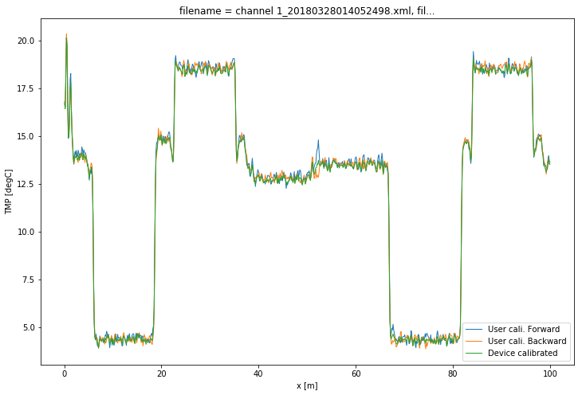
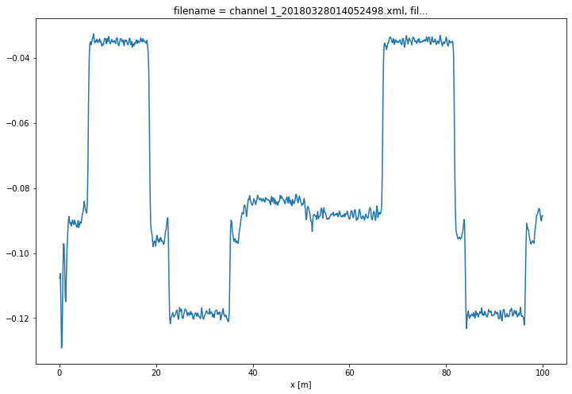

6. Calibration of double ended measurement with OLS
===================================================

Use WLS instead. See
``examples/notebooks/08Calibrate_double_wls.ipynb``.

A double ended calibration is performed with ordinary least squares.
Over all timesteps simultaneous. :math:`\gamma` and
:math:`\int_0^l\alpha`\ d\ :math:`x` remain constant, while :math:`C`
varies over time. The weights are considered equal here and no variance
is calculated.

Before starting the calibration procedure, the forward and the backward
channel should be aligned.

.. code:: ipython3

    import os
    
    from dtscalibration import read_silixa_files
    import matplotlib.pyplot as plt
    %matplotlib inline

.. code:: ipython3

    filepath = os.path.join('..', '..', 'tests', 'data', 'double_ended2')
    
    ds = read_silixa_files(
        directory=filepath,
        timezone_netcdf='UTC',
        file_ext='*.xml')
    
    ds100 = ds.sel(x=slice(0, 100))  # only calibrate parts of the fiber
    sections = {
        'probe1Temperature': [slice(7.5, 17.), slice(70., 80.)],  # cold bath
        'probe2Temperature': [slice(24., 34.), slice(85., 95.)],  # warm bath
        }

.. parsed-literal::

    6 files were found, each representing a single timestep
    6 recorded vars were found: LAF, ST, AST, REV-ST, REV-AST, TMP
    Recorded at 1693 points along the cable
    The measurement is double ended
    Reading the data from disk

.. parsed-literal::

    /home/bart/git/travis_fix/python-dts-calibration/src/dtscalibration/io.py:1843: FutureWarning: Using .astype to convert from timezone-aware dtype to timezone-naive dtype is deprecated and will raise in a future version.  Use obj.tz_localize(None) or obj.tz_convert('UTC').tz_localize(None) instead
      'time', pd.DatetimeIndex(v).tz_convert(timezone_netcdf).astype(

.. code:: ipython3

    print(ds100.calibration_double_ended.__doc__)

.. parsed-literal::

    
            Calibrate the Stokes (`ds.st`) and anti-Stokes (`ds.ast`) of the forward
            channel and from the backward channel (`ds.rst`, `ds.rast`) data to
            temperature using fiber sections with a known temperature
            (`ds.sections`) for double-ended setups. The calibrated temperature of
            the forward channel is stored under `ds.tmpf` and its variance under
            `ds.tmpf_var`, and that of the the backward channel under `ds.tmpb` and
            `ds.tmpb_var`. The inverse-variance weighted average of the forward and
            backward channel is stored under `ds.tmpw` and `ds.tmpw_var`.
    
            In double-ended setups, Stokes and anti-Stokes intensity is measured in
            two directions from both ends of the fiber. The forward-channel
            measurements are denoted with subscript F, and the backward-channel
            measurements are denoted with subscript B. Both measurement channels
            start at a different end of the fiber and have opposite directions, and
            therefore have different spatial coordinates. The first processing step
            with double-ended measurements is to align the measurements of the two
            measurement channels so that they have the same spatial coordinates. The
            spatial coordinate :math:`x` (m) is defined here positive in the forward
            direction, starting at 0 where the fiber is connected to the forward
            channel of the DTS system; the length of the fiber is :math:`L`.
            Consequently, the backward-channel measurements are flipped and shifted
            to align with the forward-channel measurements. Alignment of the
            measurements of the two channels is prone to error because it requires
            the exact fiber length (McDaniel et al., 2018). Depending on the DTS system
            used, the forward channel and backward channel are measured one after
            another by making use of an optical switch, so that only a single
            detector is needed. However, it is assumed in this paper that the
            forward channel and backward channel are measured simultaneously, so
            that the temperature of both measurements is the same. This assumption
            holds better for short acquisition times with respect to the time scale
            of the temperature variation, and when there is no systematic difference
            in temperature between the two channels. The temperature may be computed
            from the forward-channel measurements (Equation 10 [1]_) with:
    
            .. math::
    
                T_\mathrm{F} (x,t)  = \frac{\gamma}{I_\mathrm{F}(x,t) + C_\mathrm{F}(t) + \int_0^x{\Delta\alpha(x')\,\mathrm{d}x'}}
    
            and from the backward-channel measurements with:
    
            .. math::
                T_\mathrm{B} (x,t)  = \frac{\gamma}{I_\mathrm{B}(x,t) + C_\mathrm{B}(t) + \int_x^L{\Delta\alpha(x')\,\mathrm{d}x'}}
    
            with
    
            .. math::
    
                I(x,t) = \ln{\left(\frac{P_+(x,t)}{P_-(x,t)}\right)}
    
    
            .. math::
    
                C(t) = \ln{\left(\frac{\eta_-(t)K_-/\lambda_-^4}{\eta_+(t)K_+/\lambda_+^4}\right)}
    
    
            where :math:`C` is the lumped effect of the difference in gain at
            :math:`x=0` between Stokes and anti-Stokes intensity measurements and
            the dependence of the scattering intensity on the wavelength. The
            parameters :math:`P_+` and :math:`P_-` are the Stokes and anti-Stokes
            intensity measurements, respectively.
            :math:`C_\mathrm{F}(t)` and :math:`C_\mathrm{B}(t)` are the
            parameter :math:`C(t)` for the forward-channel and backward-channel
            measurements, respectively. :math:`C_\mathrm{B}(t)` may be different
            from :math:`C_\mathrm{F}(t)` due to differences in gain, and difference
            in the attenuation between the detectors and the point the fiber end is
            connected to the DTS system (:math:`\eta_+` and :math:`\eta_-` in
            Equation~\ref{eqn:c}). :math:`T` in the listed
            equations is in Kelvin, but is converted to Celsius after calibration.
            The calibration procedure presented in van de
            Giesen et al. 2012 approximates :math:`C(t)` to be
            the same for the forward and backward-channel measurements, but this
            approximation is not made here.
    
            Parameter :math:`A(x)` (`ds.alpha`) is introduced to simplify the notation of the
            double-ended calibration procedure and represents the integrated
            differential attenuation between locations :math:`x_1` and :math:`x`
            along the fiber. Location :math:`x_1` is the first reference section
            location (the smallest x-value of all used reference sections).
    
            .. math::
                A(x) = \int_{x_1}^x{\Delta\alpha(x')\,\mathrm{d}x'}
    
            so that the expressions for temperature may be written as:
    
            .. math::
                T_\mathrm{F} (x,t) = \frac{\gamma}{I_\mathrm{F}(x,t) + D_\mathrm{F}(t) + A(x)},
                T_\mathrm{B} (x,t) = \frac{\gamma}{I_\mathrm{B}(x,t) + D_\mathrm{B}(t) - A(x)}
    
            where
    
            .. math::
                D_{\mathrm{F}}(t) = C_{\mathrm{F}}(t) + \int_0^{x_1}{\Delta\alpha(x')\,\mathrm{d}x'},
                D_{\mathrm{B}}(t) = C_{\mathrm{B}}(t) + \int_{x_1}^L{\Delta\alpha(x')\,\mathrm{d}x'}
    
            Parameters :math:`D_\mathrm{F}` (`ds.df`) and :math:`D_\mathrm{B}`
            (`ds.db`) must be estimated for each time and are constant along the fiber, and parameter
            :math:`A` must be estimated for each location and is constant over time.
            The calibration procedure is discussed in Section 6.
            :math:`T_\mathrm{F}` (`ds.tmpf`) and :math:`T_\mathrm{B}` (`ds.tmpb`)
            are separate
            approximations of the same temperature at the same time. The estimated
            :math:`T_\mathrm{F}` is more accurate near :math:`x=0` because that is
            where the signal is strongest. Similarly, the estimated
            :math:`T_\mathrm{B}` is more accurate near :math:`x=L`. A single best
            estimate of the temperature is obtained from the weighted average of
            :math:`T_\mathrm{F}` and :math:`T_\mathrm{B}` as discussed in
            Section 7.2 [1]_ .
    
            Parameters
            ----------
            store_p_cov : str
                Key to store the covariance matrix of the calibrated parameters
            store_p_val : str
                Key to store the values of the calibrated parameters
            p_val : array-like, optional
                Define `p_val`, `p_var`, `p_cov` if you used an external function
                for calibration. Has size `1 + 2 * nt + nx + 2 * nt * nta`.
                First value is :math:`\gamma`, then `nt` times
                :math:`D_\mathrm{F}`, then `nt` times
                :math:`D_\mathrm{B}`, then for each location :math:`D_\mathrm{B}`,
                then for each connector that introduces directional attenuation two
                parameters per time step.
            p_var : array-like, optional
                Define `p_val`, `p_var`, `p_cov` if you used an external function
                for calibration. Has size `1 + 2 * nt + nx + 2 * nt * nta`.
                Is the variance of `p_val`.
            p_cov : array-like, optional
                The covariances of `p_val`. Square matrix.
                If set to False, no uncertainty in the parameters is propagated
                into the confidence intervals. Similar to the spec sheets of the DTS
                manufacturers. And similar to passing an array filled with zeros.
            sections : Dict[str, List[slice]], optional
                If `None` is supplied, `ds.sections` is used. Define calibration
                sections. Each section requires a reference temperature time series,
                such as the temperature measured by an external temperature sensor.
                They should already be part of the DataStore object. `sections`
                is defined with a dictionary with its keywords of the
                names of the reference temperature time series. Its values are
                lists of slice objects, where each slice object is a fiber stretch
                that has the reference temperature. Afterwards, `sections` is stored
                under `ds.sections`.
            st_var, ast_var, rst_var, rast_var : float, callable, array-like, optional
                The variance of the measurement noise of the Stokes signals in the
                forward direction. If `float` the variance of the noise from the
                Stokes detector is described with a single value.
                If `callable` the variance of the noise from the Stokes detector is
                a function of the intensity, as defined in the callable function.
                Or manually define a variance with a DataArray of the shape
                `ds.st.shape`, where the variance can be a function of time and/or
                x. Required if method is wls.
            store_df, store_db : str
                Label of where to store D. D is different for the forward channel
                and the backward channel
            store_gamma : str
                Label of where to store gamma
            store_alpha : str
                Label of where to store alpha
            store_ta : str
                Label of where to store transient alpha's
            store_tmpf : str
                Label of where to store the calibrated temperature of the forward
                direction
            store_tmpb : str
                Label of where to store the calibrated temperature of the
                backward direction
            store_tmpw : str
                Label of where to store the inverse-variance weighted average
                temperature of the forward and backward channel measurements.
            tmpw_mc_size : int
                The number of Monte Carlo samples drawn used to estimate the
                variance of the forward and backward channel temperature estimates
                and estimate the inverse-variance weighted average temperature.
            variance_suffix : str, optional
                String appended for storing the variance. Only used when method
                is wls.
            method : {'ols', 'wls', 'external'}
                Use `'ols'` for ordinary least squares and `'wls'` for weighted least
                squares. `'wls'` is the default, and there is currently no reason to
                use `'ols'`.
            solver : {'sparse', 'stats'}
                Either use the homemade weighted sparse solver or the weighted
                dense matrix solver of statsmodels. The sparse solver uses much less
                memory, is faster, and gives the same result as the statsmodels
                solver. The statsmodels solver is mostly used to check the sparse
                solver. `'stats'` is the default.
            transient_att_x, transient_asym_att_x : iterable, optional
                Depreciated. See trans_att
            trans_att : iterable, optional
                Splices can cause jumps in differential attenuation. Normal single
                ended calibration assumes these are not present. An additional loss
                term is added in the 'shadow' of the splice. Each location
                introduces an additional nt parameters to solve for. Requiring
                either an additional calibration section or matching sections.
                If multiple locations are defined, the losses are added.
            fix_gamma : Tuple[float, float], optional
                A tuple containing two floats. The first float is the value of
                gamma, and the second item is the variance of the estimate of gamma.
                Covariances between gamma and other parameters are not accounted
                for.
            fix_alpha : Tuple[array-like, array-like], optional
                A tuple containing two arrays. The first array contains the
                values of integrated differential att (:math:`A` in paper), and the
                second array contains the variance of the estimate of alpha.
                Covariances (in-) between alpha and other parameters are not
                accounted for.
            matching_sections : List[Tuple[slice, slice, bool]]
                Provide a list of tuples. A tuple per matching section. Each tuple
                has three items. The first two items are the slices of the sections
                that are matched. The third item is a boolean and is True if the two
                sections have a reverse direction ("J-configuration").
            matching_indices : array
                Provide an array of x-indices of size (npair, 2), where each pair
                has the same temperature. Used to improve the estimate of the
                integrated differential attenuation.
            verbose : bool
                Show additional calibration information
    
    
            Returns
            -------
    
            References
            ----------
            .. [1] des Tombe, B., Schilperoort, B., & Bakker, M. (2020). Estimation
                of Temperature and Associated Uncertainty from Fiber-Optic Raman-
                Spectrum Distributed Temperature Sensing. Sensors, 20(8), 2235.
                https://doi.org/10.3390/s20082235
    
            Examples
            --------
            - `Example notebook 8: Calibrate double ended <https://github.com/dtscalibration/python-dts-calibration/blob/master/examples/notebooks/08Calibrate_double_wls.ipynb>`_
    
            

.. code:: ipython3

    ds100.calibration_double_ended(sections=sections,
                                   method='ols')

After calibration, two data variables are added to the ``DataStore``
object: - ``tmpf``, temperature calculated along the forward direction -
``tmpb``, temperature calculated along the backward direction

A better estimate, with a lower expected variance, of the temperature
along the fiber is the average of the two. We cannot weigh on more than
the other, as we do not have more information about the weighing.

.. code:: ipython3

    ds1 = ds100.isel(time=0)  # take only the first timestep
    
    ds1.tmpf.plot(linewidth=1, label='User cali. Forward', figsize=(12, 8))  # plot the temperature calibrated by us
    ds1.tmpb.plot(linewidth=1, label='User cali. Backward')  # plot the temperature calibrated by us
    ds1.tmp.plot(linewidth=1, label='Device calibrated')  # plot the temperature calibrated by the device
    plt.legend();

Lets compare our calibrated values with the device calibration. Lets
average the temperature of the forward channel and the backward channel
first.

.. code:: ipython3

    ds1['TMPAVG'] = (ds1.tmpf + ds1.tmpb) / 2
    ds1_diff = ds1.tmp - ds1.TMPAVG
    
    ds1_diff.plot(figsize=(12, 8));

The device calibration sections and calibration sections defined by us
differ. The device only allows for 2 sections, one per thermometer. And
most likely the :math:`\gamma` is fixed in the device calibration.

