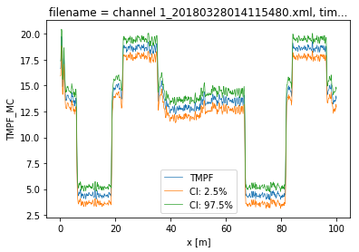

7. Calibration of double ended measurement with WLS and confidence intervals
============================================================================

A double ended calibration is performed with weighted least squares.
Over all timesteps simultaneous. :math:`\gamma` and :math:`\alpha`
remain constant, while :math:`C` varies over time. The weights are not
considered equal here. The weights kwadratically decrease with the
signal strength of the measured Stokes and anti-Stokes signals.

The confidence intervals can be calculated as the weights are correctly
defined.

.. code:: ipython3

    import os
    
    from dtscalibration import read_xml_dir
    import matplotlib.pyplot as plt
    %matplotlib inline

.. code:: ipython3

    try:
        wd = os.path.dirname(os.path.realpath(__file__))
    except:
        wd = os.getcwd()
    
    filepath = os.path.join(wd, '..', '..', 'tests', 'data', 'double_ended2')
    timezone_netcdf = 'UTC',
    timezone_ultima_xml = 'Europe/Amsterdam'
    file_ext = '*.xml'
    
    ds_ = read_xml_dir(filepath,
                      timezone_netcdf=timezone_netcdf,
                      timezone_ultima_xml=timezone_ultima_xml,
                      file_ext=file_ext)
    
    ds = ds_.sel(x=slice(0, 100))  # only calibrate parts of the fiber
    sections = {
        'probe1Temperature': [slice(7.5, 17.), slice(70., 80.)],  # cold bath
        'probe2Temperature': [slice(24., 34.), slice(85., 95.)],  # warm bath
        }
    ds.sections = sections

.. parsed-literal::

    6 files were found, each representing a single timestep
    6 recorded vars were found: LAF, ST, AST, REV-ST, REV-AST, TMP
    Recorded at 1693 points along the cable
    Dask: Setting up handle for delayed readout. 1 out of 6
    Dask: Setting up handle for delayed readout. 6 out of 6
    Directly reading time and extra info from xml files. 1 out of 6
    Directly reading time and extra info from xml files. 6 out of 6

.. code:: ipython3

    st_label = 'ST'
    ast_label = 'AST'
    rst_label = 'REV-ST'
    rast_label = 'REV-AST'

First calculate the variance in the measured Stokes and anti-Stokes
signals, in the forward and backward direction.

The Stokes and anti-Stokes signals should follow a smooth decaying
exponential. This function fits a decaying exponential to each reference
section for each time step. The variance of the residuals between the
measured Stokes and anti-Stokes signals and the fitted signals is used
as an estimate of the variance in measured signals.

.. code:: ipython3

    st_var, resid = ds.variance_stokes(st_label=st_label, suppress_info=1)
    ast_var, _ = ds.variance_stokes(st_label=ast_label, suppress_info=1)
    rst_var, _ = ds.variance_stokes(st_label=rst_label, suppress_info=1)
    rast_var, _ = ds.variance_stokes(st_label=rast_label, suppress_info=1)

Similar to the ols procedure, we make a single function call to
calibrate the temperature. If the method is ``wls`` and confidence
intervals are passed to ``conf_ints``, confidence intervals calculated.
As weigths are correctly passed to the least squares procedure, the
covariance matrix can be used. This matrix holds the covariances between
all the parameters. A large parameter set is generated from this matrix,
assuming the parameter space is normally distributed with their mean at
the best estimate of the least squares procedure.

The large parameter set is used to calculate a large set of
temperatures. By using ``percentiles`` or ``quantile`` the 95%
confidence interval of the calibrated temperature between 2.5% and 97.5%
are calculated.

The confidence intervals differ per time step. If you would like to
calculate confidence intervals of all time steps together you have the
option ``ci_avg_time_flag=True``. ‘We can say with 95% confidence that
the temperature remained between this line and this line during the
entire measurement period’.

.. code:: ipython3

    ds.calibration_double_ended(
        sections=sections,
        st_label=st_label,
        ast_label=ast_label,
        rst_label=rst_label,
        rast_label=rast_label,
        st_var=st_var,
        ast_var=ast_var,
        rst_var=rst_var,
        rast_var=rast_var,
        method='wls',
        conf_ints=[2.5, 50., 97.5],
        conf_ints_size=500,
        ci_avg_time_flag=False,
        store_tempvar='_var',
        solver='sparse')

.. code:: ipython3

    ds1 = ds.isel(time=-1)  # take only the first timestep
    ds1.TMPF.plot(linewidth=0.7)
    ds1.TMPF_MC.isel(CI=0).plot(linewidth=0.7, label='CI: 2.5%')
    ds1.TMPF_MC.isel(CI=2).plot(linewidth=0.7, label='CI: 97.5%')
    plt.legend();

The DataArrays ``TMPF_MC`` and ``TMPB_MC`` and the dimension ``CI`` are
added. ``MC`` stands for monte carlo and the ``CI`` dimension holds the
confidence interval ‘coordinates’.

.. code:: ipython3

    ds.data_vars

.. parsed-literal::

    Data variables:
        ST                     (x, time) float32 dask.array<shape=(787, 6), chunksize=(787, 1)>
        AST                    (x, time) float32 dask.array<shape=(787, 6), chunksize=(787, 1)>
        REV-ST                 (x, time) float32 dask.array<shape=(787, 6), chunksize=(787, 1)>
        REV-AST                (x, time) float32 dask.array<shape=(787, 6), chunksize=(787, 1)>
        TMP                    (x, time) float32 dask.array<shape=(787, 6), chunksize=(787, 1)>
        acquisitionTime        (time) float64 2.098 2.075 2.076 2.133 2.085 2.062
        referenceTemperature   (time) float64 21.05 21.05 21.05 21.05 21.05 21.06
        probe1Temperature      (time) float64 4.361 4.36 4.359 4.36 4.36 4.361
        probe2Temperature      (time) float64 18.58 18.58 18.58 18.58 18.58 18.57
        referenceProbeVoltage  (time) float64 0.1217 0.1217 0.1217 ... 0.1217 0.1217
        probe1Voltage          (time) float64 0.114 0.114 0.114 0.114 0.114 0.114
        probe2Voltage          (time) float64 0.121 0.121 0.121 0.121 0.121 0.121
        userAcquisitionTimeFW  (time) float64 2.0 2.0 2.0 2.0 2.0 2.0
        userAcquisitionTimeBW  (time) float64 2.0 2.0 2.0 2.0 2.0 2.0
        gamma                  float64 482.6
        alphaint               float64 -0.01034
        alpha                  (x) float64 -0.01233 -0.008471 ... -0.01044 -0.01034
        c                      (time) float64 1.47 1.471 1.47 1.47 1.471 1.47
        gamma_var              float64 0.03868
        alphaint_var           float64 7.387e-07
        alpha_var              (x) float64 3.563e-07 3.489e-07 ... 7.284e-07
        c_var                  (time) float64 6.632e-07 6.632e-07 ... 6.632e-07
        TMPF                   (x, time) float64 dask.array<shape=(787, 6), chunksize=(787, 1)>
        TMPB                   (x, time) float64 dask.array<shape=(787, 6), chunksize=(787, 1)>
        p_val                  (params1) float64 482.6 -0.01034 ... -0.01034
        p_cov                  (params1, params2) float64 0.03868 ... 7.284e-07
        TMPF_MC                (CI, x, time) float64 dask.array<shape=(3, 787, 6), chunksize=(3, 787, 6)>
        TMPB_MC                (CI, x, time) float64 dask.array<shape=(3, 787, 6), chunksize=(3, 787, 6)>
        TMPF_MC_var            (x, time) float64 dask.array<shape=(787, 6), chunksize=(787, 1)>
        TMPB_MC_var            (x, time) float64 dask.array<shape=(787, 6), chunksize=(787, 1)>

