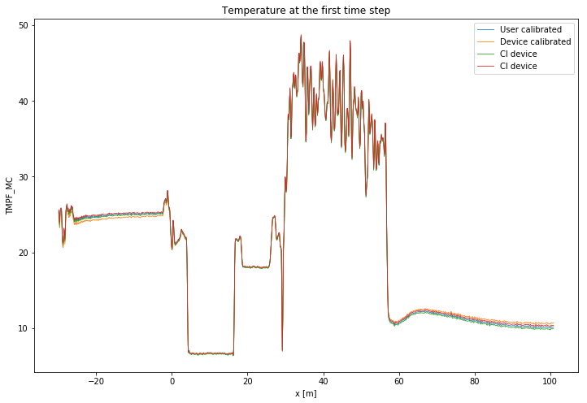
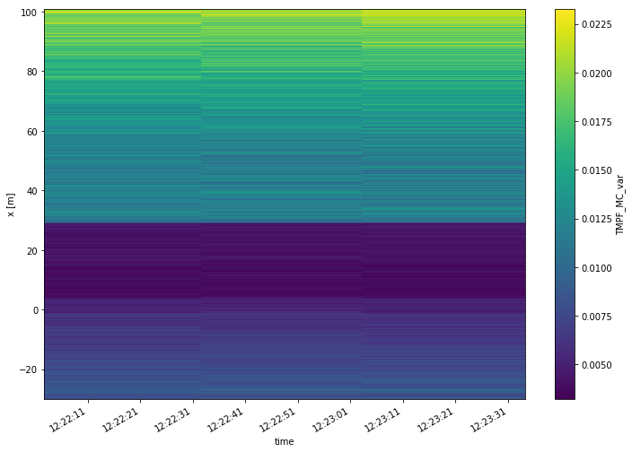
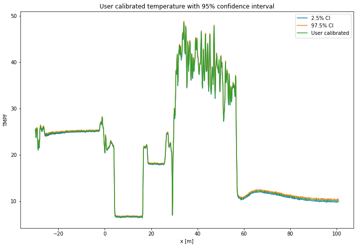
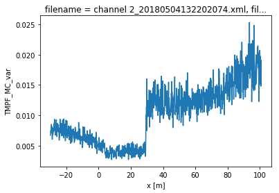
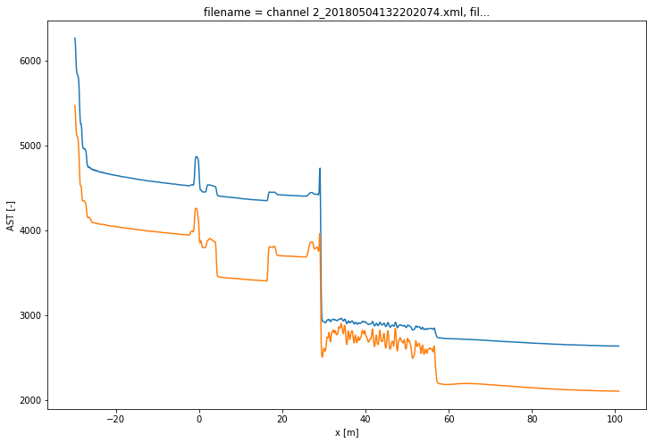

7. Calibration of single ended measurement with WLS and confidence intervals
============================================================================

A single ended calibration is performed with weighted least squares.
Over all timesteps simultaneous. :math:`\gamma` and :math:`\alpha`
remain constant, while :math:`C` varies over time. The weights are not
considered equal here. The weights kwadratically decrease with the
signal strength of the measured Stokes and anti-Stokes signals.

The confidence intervals can be calculated as the weights are correctly
defined.

The confidence intervals consist of two sources of uncertainty.

1. Measurement noise in the measured Stokes and anti-Stokes signals.
   Expressed in a single variance value.
2. Inherent to least squares procedures / overdetermined systems, the
   parameters are estimated with limited certainty and all parameters
   are correlated. Which is expressen in the covariance matrix.

Both sources of uncertainty are propagated to an uncertainty in the
estimated temperature via Monte Carlo.

.. code:: ipython3

    import os
    
    from dtscalibration import read_silixa_files
    import matplotlib.pyplot as plt
    %matplotlib inline

.. code:: ipython3

    filepath = os.path.join('..', '..', 'tests', 'data', 'single_ended')
    ds = read_silixa_files(
        directory=filepath,
        timezone_netcdf='UTC',
        file_ext='*.xml')
    
    ds = ds.sel(x=slice(-30, 101))  # only calibrate parts of the fiber
    sections = {
                'probe1Temperature':    [slice(20, 25.5)],  # warm bath
                'probe2Temperature':    [slice(5.5, 15.5)],  # cold bath
    #             'referenceTemperature': [slice(-24., -4)]  # The internal coil is not so uniform
                }
    ds.sections = sections

.. parsed-literal::

    3 files were found, each representing a single timestep
    4 recorded vars were found: LAF, ST, AST, TMP
    Recorded at 1461 points along the cable
    The measurement is single ended
    Reading the data from disk

.. code:: ipython3

    print(ds.calibration_single_ended.__doc__)

.. parsed-literal::

    
    
            Parameters
            ----------
            store_p_cov : str
                Key to store the covariance matrix of the calibrated parameters
            store_p_val : str
                Key to store the values of the calibrated parameters
            p_val : array-like, optional
            p_var : array-like, optional
            p_cov : array-like, optional
            sections : dict, optional
            st_label : str
                Label of the forward stokes measurement
            ast_label : str
                Label of the anti-Stoke measurement
            st_var : float, optional
                The variance of the measurement noise of the Stokes signals in
                the forward
                direction Required if method is wls.
            ast_var : float, optional
                The variance of the measurement noise of the anti-Stokes signals
                in the forward
                direction. Required if method is wls.
            store_c : str
                Label of where to store C
            store_gamma : str
                Label of where to store gamma
            store_dalpha : str
                Label of where to store dalpha; the spatial derivative  of alpha.
            store_alpha : str
                Label of where to store alpha; The integrated differential
                attenuation.
                alpha(x=0) = 0
            store_tmpf : str
                Label of where to store the calibrated temperature of the forward
                direction
            variance_suffix : str, optional
                String appended for storing the variance. Only used when method
                is wls.
            method : {'ols', 'wls'}
                Use 'ols' for ordinary least squares and 'wls' for weighted least
                squares
            solver : {'sparse', 'stats'}
                Either use the homemade weighted sparse solver or the weighted
                dense matrix solver of
                statsmodels
    
            Returns
            -------
    
            

.. code:: ipython3

    st_label = 'ST'
    ast_label = 'AST'

First calculate the variance in the measured Stokes and anti-Stokes
signals, in the forward and backward direction.

The Stokes and anti-Stokes signals should follow a smooth decaying
exponential. This function fits a decaying exponential to each reference
section for each time step. The variance of the residuals between the
measured Stokes and anti-Stokes signals and the fitted signals is used
as an estimate of the variance in measured signals.

.. code:: ipython3

    st_var, resid = ds.variance_stokes(st_label=st_label)
    ast_var, _ = ds.variance_stokes(st_label=ast_label)

Similar to the ols procedure, we make a single function call to
calibrate the temperature. If the method is ``wls`` and confidence
intervals are passed to ``conf_ints``, confidence intervals calculated.
As weigths are correctly passed to the least squares procedure, the
covariance matrix can be used. This matrix holds the covariances between
all the parameters. A large parameter set is generated from this matrix,
assuming the parameter space is normally distributed with their mean at
the best estimate of the least squares procedure.

The large parameter set is used to calculate a large set of
temperatures. By using ``percentiles`` or ``quantile`` the 95%
confidence interval of the calibrated temperature between 2.5% and 97.5%
are calculated.

The confidence intervals differ per time step. If you would like to
calculate confidence intervals of all time steps together you have the
option ``ci_avg_time_flag=True``. ‘We can say with 95% confidence that
the temperature remained between this line and this line during the
entire measurement period’.

.. code:: ipython3

    ds.calibration_single_ended(sections=sections,
                                st_label=st_label,
                                ast_label=ast_label,
                                st_var=st_var,
                                ast_var=ast_var,
                                method='wls',
                                solver='sparse',
                                store_p_val='p_val',
                                store_p_cov='p_cov'
                                )

.. parsed-literal::

    /Users/bfdestombe/Projects/dts-calibration/python-dts-calibration-dev/.tox/docs/lib/python3.7/site-packages/dask/array/core.py:1328: FutureWarning: The `numpy.ndim` function is not implemented by Dask array. You may want to use the da.map_blocks function or something similar to silence this warning. Your code may stop working in a future release.
      FutureWarning,

.. code:: ipython3

    ds.conf_int_single_ended(
        p_val='p_val',
        p_cov='p_cov',
        st_label=st_label,
        ast_label=ast_label,
        st_var=st_var,
        ast_var=ast_var,
        store_tmpf='TMPF',
        store_tempvar='_var',
        conf_ints=[2.5, 97.5],
        mc_sample_size=500,
        ci_avg_time_flag=False)

Lets compare our calibrated values with the device calibration

.. code:: ipython3

    ds1 = ds.isel(time=0)  # take only the first timestep
    ds1.TMPF.plot(linewidth=0.8, figsize=(12, 8), label='User calibrated')  # plot the temperature calibrated by us
    ds1.TMP.plot(linewidth=0.8, label='Device calibrated')  # plot the temperature calibrated by the device
    ds1.TMPF_MC.plot(linewidth=0.8, hue='CI', label='CI device')
    plt.title('Temperature at the first time step')
    plt.legend();

.. code:: ipython3

    ds.TMPF_MC_var.plot(figsize=(12, 8));

.. code:: ipython3

    ds1.TMPF_MC.sel(CI=2.5).plot(label = '2.5% CI', figsize=(12, 8))
    ds1.TMPF_MC.sel(CI=97.5).plot(label = '97.5% CI')
    ds1.TMPF.plot(label='User calibrated')
    plt.title('User calibrated temperature with 95% confidence interval')
    plt.legend();

We can tell from the graph above that the 95% confidence interval widens
furtherdown the cable. Lets have a look at the calculated variance along
the cable for a single timestep. According to the device manufacturer
this should be around 0.0059 degC.

.. code:: ipython3

    ds1.TMPF_MC_var.plot(figsize=(12, 8));

The variance of the temperature measurement appears to be larger than
what the manufacturer reports. This is already the case for the internal
cable; it is not caused by a dirty connector/bad splice on our side.
Maybe the length of the calibration section was not sufficient.

At 30 m the variance sharply increases. There are several possible
explanations. E.g., large temperatures or decreased signal strength.

Lets have a look at the Stokes and anti-Stokes signal.

.. code:: ipython3

    ds1.ST.plot(figsize=(12, 8))
    ds1.AST.plot();

Clearly there was a bad splice at 30 m that resulted in the sharp
increase of measurement uncertainty for the cable section after the bad
splice.

