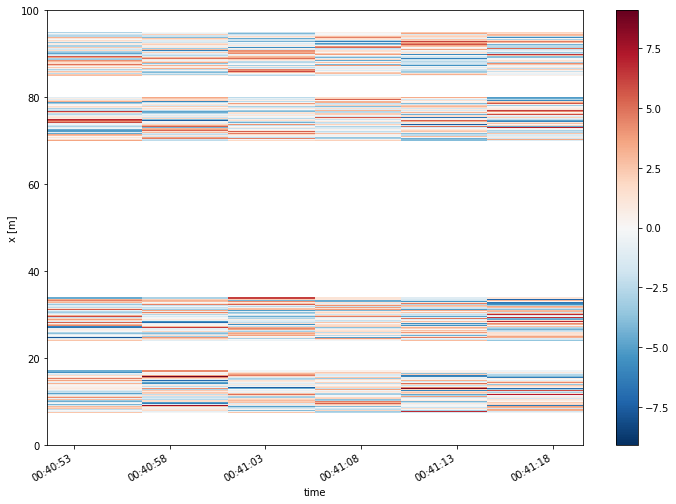

8. Calibration of double ended measurement with WLS and confidence intervals
============================================================================

A double ended calibration is performed with weighted least squares.
Over all timesteps simultaneous. :math:`\gamma` and :math:`\alpha`
remain constant, while :math:`C` varies over time. The weights are not
considered equal here. The weights kwadratically decrease with the
signal strength of the measured Stokes and anti-Stokes signals.

The confidence intervals can be calculated as the weights are correctly
defined.

The confidence intervals consist of two sources of uncertainty.

1. Measurement noise in the measured Stokes and anti-Stokes signals.
   Expressed in a single variance value.
2. Inherent to least squares procedures / overdetermined systems, the
   parameters are estimated with limited certainty and all parameters
   are correlated. Which is expressen in the covariance matrix.

Both sources of uncertainty are propagated to an uncertainty in the
estimated temperature via Monte Carlo.

.. code:: ipython3

    import os
    
    from dtscalibration import read_silixa_files
    import matplotlib.pyplot as plt
    %matplotlib inline

.. code:: ipython3

    filepath = os.path.join('..', '..', 'tests', 'data', 'double_ended2')
    
    ds_ = read_silixa_files(
        directory=filepath,
        timezone_netcdf='UTC',
        file_ext='*.xml')
    
    ds = ds_.sel(x=slice(0, 100))  # only calibrate parts of the fiber
    sections = {
        'probe1Temperature': [slice(7.5, 17.), slice(70., 80.)],  # cold bath
        'probe2Temperature': [slice(24., 34.), slice(85., 95.)],  # warm bath
        }
    ds.sections = sections

.. parsed-literal::

    6 files were found, each representing a single timestep
    6 recorded vars were found: LAF, ST, AST, REV-ST, REV-AST, TMP
    Recorded at 1693 points along the cable
    The measurement is double ended
    Reading the data from disk

.. code:: ipython3

    st_label = 'ST'
    ast_label = 'AST'
    rst_label = 'REV-ST'
    rast_label = 'REV-AST'

First calculate the variance in the measured Stokes and anti-Stokes
signals, in the forward and backward direction.

The Stokes and anti-Stokes signals should follow a smooth decaying
exponential. This function fits a decaying exponential to each reference
section for each time step. The variance of the residuals between the
measured Stokes and anti-Stokes signals and the fitted signals is used
as an estimate of the variance in measured signals.

.. code:: ipython3

    st_var, resid = ds.variance_stokes(st_label=st_label, suppress_info=1)
    ast_var, _ = ds.variance_stokes(st_label=ast_label, suppress_info=1)
    rst_var, _ = ds.variance_stokes(st_label=rst_label, suppress_info=1)
    rast_var, _ = ds.variance_stokes(st_label=rast_label, suppress_info=1)

.. code:: ipython3

    resid.plot(figsize=(12, 8));

We calibrate the measurement with a single method call. The labels refer
to the keys in the DataStore object containing the Stokes, anti-Stokes,
reverse Stokes and reverse anti-Stokes. The variance in those
measurements were calculated in the previous step. We use a sparse
solver because it saves us memory.

.. code:: ipython3

    ds.calibration_double_ended(
        st_label=st_label,
        ast_label=ast_label,
        rst_label=rst_label,
        rast_label=rast_label,
        st_var=st_var,
        ast_var=ast_var,
        rst_var=rst_var,
        rast_var=rast_var,
        method='wls',
        solver='sparse')

With another method call we estimate the confidence intervals. If the
method is ``wls`` and confidence intervals are passed to ``conf_ints``,
confidence intervals calculated. As weigths are correctly passed to the
least squares procedure, the covariance matrix can be used as an
estimator for the uncertainty in the parameters. This matrix holds the
covariances between all the parameters. A large parameter set is
generated from this matrix as part of the Monte Carlo routine, assuming
the parameter space is normally distributed with their mean at the best
estimate of the least squares procedure.

The large parameter set is used to calculate a large set of
temperatures. By using ``percentiles`` or ``quantile`` the 95%
confidence interval of the calibrated temperature between 2.5% and 97.5%
are calculated.

The confidence intervals differ per time step. If you would like to
calculate confidence intervals of all time steps together you have the
option ``ci_avg_time_flag=True``. 'We can say with 95% confidence that
the temperature remained between this line and this line during the
entire measurement period'. This is ideal if you'd like to calculate the
background temperature with a confidence interval.

.. code:: ipython3

    ds.conf_int_double_ended(
        p_val='p_val',
        p_cov='p_cov',
        st_label=st_label,
        ast_label=ast_label,
        rst_label=rst_label,
        rast_label=rast_label,
        st_var=st_var,
        ast_var=ast_var,
        rst_var=rst_var,
        rast_var=rast_var,
        store_tmpf='TMPF',
        store_tmpb='TMPB',
        store_tmpw='TMPW',  # <- 
        store_tempvar='_var',
        conf_ints=[2.5, 50., 97.5],
        conf_ints_size=500,
        ci_avg_time_flag=False)

.. code:: ipython3

    ds1 = ds.isel(time=-1)  # take only the first timestep
    ds1.TMPW.plot(linewidth=0.7, figsize=(12, 8))
    ds1.TMPW_MC.isel(CI=0).plot(linewidth=0.7, label='CI: 2.5%')
    ds1.TMPW_MC.isel(CI=2).plot(linewidth=0.7, label='CI: 97.5%')
    plt.legend();

.. image:: 08Calibrate_double_wls.ipynb_files/08Calibrate_double_wls.ipynb_13_0.png

The DataArrays ``TMPF_MC`` and ``TMPB_MC`` and the dimension ``CI`` are
added. ``MC`` stands for monte carlo and the ``CI`` dimension holds the
confidence interval 'coordinates'.

.. code:: ipython3

    (ds1.TMPW_MC_var**0.5).plot(figsize=(12, 4));
    plt.ylabel('$\sigma$ ($^\circ$C)');

.. image:: 08Calibrate_double_wls.ipynb_files/08Calibrate_double_wls.ipynb_15_0.png

.. code:: ipython3

    ds.data_vars

.. parsed-literal::

    Data variables:
        ST                     (x, time) float64 4.049e+03 4.044e+03 ... 3.501e+03
        AST                    (x, time) float64 3.293e+03 3.296e+03 ... 2.803e+03
        REV-ST                 (x, time) float64 4.061e+03 4.037e+03 ... 4.584e+03
        REV-AST                (x, time) float64 3.35e+03 3.333e+03 ... 3.707e+03
        TMP                    (x, time) float64 16.69 16.87 16.51 ... 13.6 13.69
        acquisitionTime        (time) float32 2.098 2.075 2.076 2.133 2.085 2.062
        referenceTemperature   (time) float32 21.0536 21.054 ... 21.0531 21.057
        probe1Temperature      (time) float32 4.36149 4.36025 ... 4.36021 4.36118
        probe2Temperature      (time) float32 18.5792 18.5785 ... 18.5805 18.5723
        referenceProbeVoltage  (time) float32 0.121704 0.121704 ... 0.121705
        probe1Voltage          (time) float32 0.114 0.114 0.114 0.114 0.114 0.114
        probe2Voltage          (time) float32 0.121 0.121 0.121 0.121 0.121 0.121
        userAcquisitionTimeFW  (time) float32 2.0 2.0 2.0 2.0 2.0 2.0
        userAcquisitionTimeBW  (time) float32 2.0 2.0 2.0 2.0 2.0 2.0
        gamma                  float64 482.6
        alpha                  (x) float64 -0.007156 -0.003301 ... -0.005165
        d                      (time) float64 1.465 1.465 1.465 1.465 1.465 1.465
        gamma_var              float64 0.04003
        alpha_var              (x) float64 3.405e-07 3.56e-07 ... 3.374e-07
        d_var                  (time) float64 4.948e-07 4.948e-07 ... 4.948e-07
        TMPF                   (x, time) float64 16.79 17.04 16.32 ... 13.51 13.77
        TMPB                   (x, time) float64 16.8 16.82 16.87 ... 13.76 13.68
        p_val                  (params1) float64 482.6 1.465 ... -0.005271 -0.005165
        p_cov                  (params1, params2) float64 0.04003 ... 3.374e-07
        TMPF_MC_var            (x, time) float64 dask.array<shape=(787, 6), chunksize=(787, 6)>
        TMPB_MC_var            (x, time) float64 dask.array<shape=(787, 6), chunksize=(787, 6)>
        TMPF_MC                (CI, x, time) float64 dask.array<shape=(3, 787, 6), chunksize=(3, 787, 6)>
        TMPB_MC                (CI, x, time) float64 dask.array<shape=(3, 787, 6), chunksize=(3, 787, 6)>
        TMPW_MC                (CI, x, time) float64 dask.array<shape=(3, 787, 6), chunksize=(3, 787, 6)>
        TMPW                   (x, time) float64 dask.array<shape=(787, 6), chunksize=(787, 6)>
        TMPW_MC_var            (x, time) float64 dask.array<shape=(787, 6), chunksize=(787, 6)>

