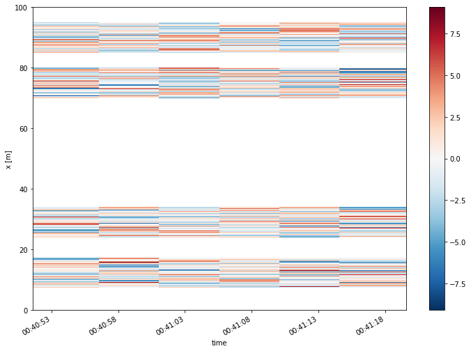
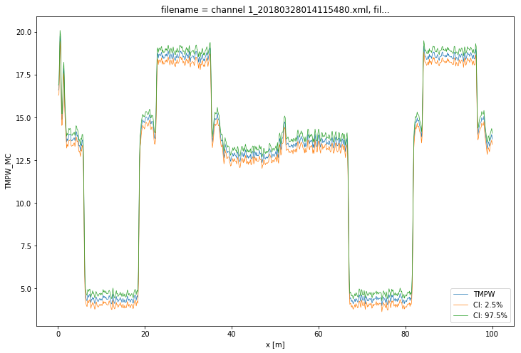
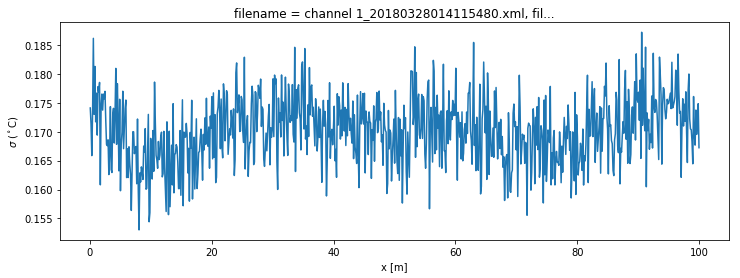

8. Calibration of double ended measurement with WLS and confidence intervals
============================================================================

A double-ended calibration is performed where the unknown parameters are
estimated using fiber sections that have a reference temperature. The
parameters are estimated with a weighted least squares optimization
using Stokes and anti-Stokes measurements from all timesteps. Thus
Stokes and anti-Stokes measurements with a large signal to noise ratio
contribute more towards estimating the optimal parameter set. But an
estimate of the noise variance is required.

Double-ended calibration requires a few steps. Please have a look at [1]
for more information: 1. Read the raw data files loaded from your DTS
machine 2. Define the reference sections: fiber sections that have a
known temperature. 3. Estimate the variance of the noise in the Stokes
and anti-Stokes measurements 4. Perform the parameter search and compute
the temperature along the entire fiber. 5. Compute the confidence
intervals for the temperature

[1]: des Tombe, B., Schilperoort, B., & Bakker, M. (2020). Estimation of
Temperature and Associated Uncertainty from Fiber-Optic Raman-Spectrum
Distributed Temperature Sensing. Sensors, 20(8), 2235.
https://doi.org/10.3390/s20082235

.. code:: ipython3

    import os
    import warnings
    
    warnings.simplefilter('ignore')  # Hide warnings to avoid clutter in the notebook
    
    
    from dtscalibration import read_silixa_files
    import matplotlib.pyplot as plt
    %matplotlib inline

.. code:: ipython3

    filepath = os.path.join('..', '..', 'tests', 'data', 'double_ended2')
    
    ds_ = read_silixa_files(
        directory=filepath,
        timezone_netcdf='UTC',
        file_ext='*.xml')
    
    ds = ds_.sel(x=slice(0, 100))  # only calibrate parts of the fiber
    sections = {
        'probe1Temperature': [slice(7.5, 17.), slice(70., 80.)],  # cold bath
        'probe2Temperature': [slice(24., 34.), slice(85., 95.)],  # warm bath
        }
    ds.sections = sections

.. parsed-literal::

    6 files were found, each representing a single timestep
    6 recorded vars were found: LAF, ST, AST, REV-ST, REV-AST, TMP
    Recorded at 1693 points along the cable
    The measurement is double ended
    Reading the data from disk

First calculate the variance in the measured Stokes and anti-Stokes
signals, in the forward and backward direction.

The Stokes and anti-Stokes signals should follow a smooth decaying
exponential. This function fits a decaying exponential to each reference
section for each time step. The variance of the residuals between the
measured Stokes and anti-Stokes signals and the fitted signals is used
as an estimate of the variance in measured signals.

.. code:: ipython3

    st_var, resid = ds.variance_stokes_constant(st_label='st')
    ast_var, _ = ds.variance_stokes_constant(st_label='ast')
    rst_var, _ = ds.variance_stokes_constant(st_label='rst')
    rast_var, _ = ds.variance_stokes_constant(st_label='rast')

.. code:: ipython3

    resid.plot(figsize=(12, 8));

We calibrate the measurement with a single method call. The labels refer
to the keys in the DataStore object containing the Stokes, anti-Stokes,
reverse Stokes and reverse anti-Stokes. The variance in those
measurements were calculated in the previous step. We use a sparse
solver because it saves us memory.

.. code:: ipython3

    ds.calibration_double_ended(
        st_var=st_var,
        ast_var=ast_var,
        rst_var=rst_var,
        rast_var=rast_var,
        store_tmpw='tmpw',
        method='wls',
        solver='sparse')

.. code:: ipython3

    ds.tmpw.plot()

.. parsed-literal::

    <matplotlib.collections.QuadMesh at 0x7fdc4cc7ee50>

.. image:: 08Calibrate_double_wls.ipynb_files/08Calibrate_double_wls.ipynb_9_1.png

Confidence intervals
--------------------

With another method call we estimate the confidence intervals. If the
method is ``wls`` and confidence intervals are passed to ``conf_ints``,
confidence intervals calculated. As weigths are correctly passed to the
least squares procedure, the covariance matrix can be used as an
estimator for the uncertainty in the parameters. This matrix holds the
covariances between all the parameters. A large parameter set is
generated from this matrix as part of the Monte Carlo routine, assuming
the parameter space is normally distributed with their mean at the best
estimate of the least squares procedure.

The large parameter set is used to calculate a large set of
temperatures. By using ``percentiles`` or ``quantile`` the 95%
confidence interval of the calibrated temperature between 2.5% and 97.5%
are calculated.

The confidence intervals differ per time step. If you would like to
calculate confidence intervals temporal averages or averages of fiber
sections see notebook 16.

.. code:: ipython3

    ds.conf_int_double_ended(
        st_var=st_var,
        ast_var=ast_var,
        rst_var=rst_var,
        rast_var=rast_var,
        conf_ints=[2.5, 50., 97.5],
        mc_sample_size=500)  # <- choose a much larger sample size)

.. code:: ipython3

    ds1 = ds.isel(time=-1)  # take only the first timestep
    ds1.tmpw.plot(linewidth=0.7, figsize=(12, 8))
    ds1.tmpw_mc.isel(CI=0).plot(linewidth=0.7, label='CI: 2.5%')
    ds1.tmpw_mc.isel(CI=2).plot(linewidth=0.7, label='CI: 97.5%')
    plt.legend();

The DataArrays ``tmpf_mc`` and ``tmpb_mc`` and the dimension ``CI`` are
added. ``MC`` stands for monte carlo and the ``CI`` dimension holds the
confidence interval ‘coordinates’.

.. code:: ipython3

    (ds1.tmpw_mc_var**0.5).plot(figsize=(12, 4));
    plt.ylabel('$\sigma$ ($^\circ$C)');

