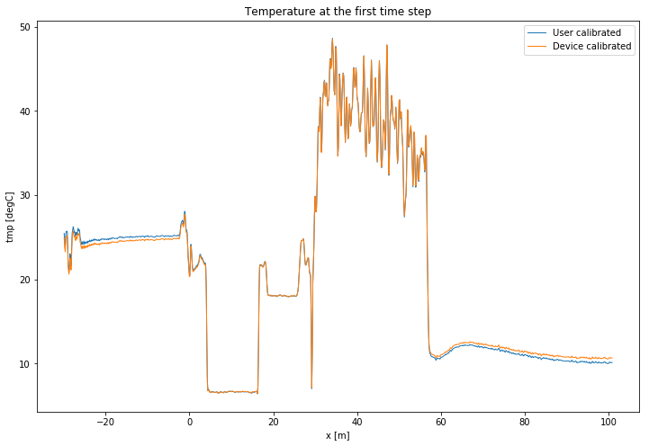

13. Fixing calibration parameters
=================================

In this notebook we will demonstrate how to fix the calibration
parameters :math:`\gamma` and :math:`\alpha`. This can be useful in
setups where you have insufficient reference sections to calibrate
these, but you do have information on these parameters from previous
setups with the same fiber.

We will be using the same dataset as notebook 5. Calibration of
single-ended measurement with OLS

.. code:: ipython3

    import os
    
    from dtscalibration import read_silixa_files
    import matplotlib.pyplot as plt
    
    %matplotlib inline
    
    filepath = os.path.join('..', '..', 'tests', 'data', 'single_ended')
    
    ds = read_silixa_files(
        directory=filepath,
        timezone_netcdf='UTC',
        file_ext='*.xml')
    
    ds100 = ds.sel(x=slice(-30, 101))  # only calibrate parts of the fiber, in meters
    sections = {
                'probe1Temperature':    [slice(20, 25.5)],  # we only use the warm bath in this notebook
                }
    ds100.sections = sections

.. parsed-literal::

    3 files were found, each representing a single timestep
    4 recorded vars were found: LAF, ST, AST, TMP
    Recorded at 1461 points along the cable
    The measurement is single ended
    Reading the data from disk

.. parsed-literal::

    /home/bart/git/travis_fix/python-dts-calibration/src/dtscalibration/io.py:1843: FutureWarning: Using .astype to convert from timezone-aware dtype to timezone-naive dtype is deprecated and will raise in a future version.  Use obj.tz_localize(None) or obj.tz_convert('UTC').tz_localize(None) instead
      'time', pd.DatetimeIndex(v).tz_convert(timezone_netcdf).astype(

From the previous calibration we know that the :math:`\gamma` parameter
value was 481.9 and the :math:`\alpha` value was -2.014e-05. We define
these, along with their variance. In this case we do not know what the
variance was, as we ran an OLS calibration, so we will set the variance
to 0.

It is important to note that when setting parameters, the covariances
between the parameters are not taken into account in the uncertainty.

.. code:: ipython3

    fix_gamma = (481.9, 0)  # (gamma value, gamma variance)
    fix_dalpha = (-2.014e-5, 0)  # (alpha value, alpha variance)
    
    ds100.calibration_single_ended(fix_gamma=fix_gamma,
                                   fix_dalpha=fix_dalpha,
                                   method='ols')

Let’s see if fixing the parameters worked:

.. code:: ipython3

    print('gamma used in calibration:', ds100.gamma.values)
    print('dalpha used in calibration:', ds100.dalpha.values)

.. parsed-literal::

    gamma used in calibration: 481.9
    dalpha used in calibration: -2.014e-05

Let’s plot the calibrated temperature. You’ll see that this gives the
same result as in notebook 05.

.. code:: ipython3

    ds1 = ds100.isel(time=0)  # take only the first timestep
    
    ds1.tmpf.plot(linewidth=1, figsize=(12, 8), label='User calibrated')  # plot the temperature calibrated by us
    ds1.tmp.plot(linewidth=1, label='Device calibrated')  # plot the temperature calibrated by the device
    plt.title('Temperature at the first time step')
    plt.legend();

