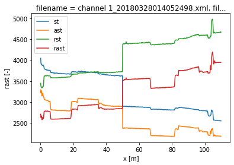
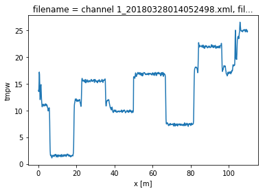
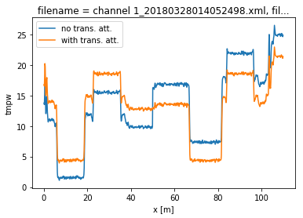

14. Calibration over (lossy) splices and connectors
===================================================

Background
----------

While it is best practice to not have connectors or splices within a DTS
calibration, sometimes it can’t be avoided. For example, in a borehole
the fibers in a duplex cable are often connected with either a splice or
a loopback connector.

Splices and connectors will cause a step loss in the signal strength,
and with varying strain and temperature, this step loss will vary. In
double ended setups this step loss can even be asymmetrical for the
forward and backward measurements. All these effects have to be taken
into account in the calibration.

To calibrate over these splices/connectors, locations with ‘transient
attenuation’ can be defined along the length of the fiber. Adding these
does mean that more information is needed to perform the calibration,
such as extra reference sections or matching sections of fiber. Matching
sections will be explained in notebook 15.

Demonstration
~~~~~~~~~~~~~

To demonstrate the effect of a lossy splice, we’ll load the same dataset
that was used in previous notebooks, and modify the data to simulate a
lossy splice.

.. code:: ipython3

    import os
    
    from dtscalibration import read_silixa_files
    import matplotlib.pyplot as plt
    %matplotlib inline

.. code:: ipython3

    filepath = os.path.join('..', '..', 'tests', 'data', 'double_ended2')
    
    ds_ = read_silixa_files(
        directory=filepath,
        timezone_netcdf='UTC',
        file_ext='*.xml')
    
    ds = ds_.sel(x=slice(0, 110))  # only calibrate parts of the fiber
    
    
    sections = {
        'probe1Temperature': [slice(7.5, 17.), slice(70., 80.)],  # cold bath
        'probe2Temperature': [slice(24., 34.), slice(85., 95.)],  # warm bath
        }
    ds.sections = sections

.. parsed-literal::

    6 files were found, each representing a single timestep
    6 recorded vars were found: LAF, ST, AST, REV-ST, REV-AST, TMP
    Recorded at 1693 points along the cable
    The measurement is double ended
    Reading the data from disk

.. parsed-literal::

    /home/bart/git/travis_fix/python-dts-calibration/src/dtscalibration/io.py:1843: FutureWarning: Using .astype to convert from timezone-aware dtype to timezone-naive dtype is deprecated and will raise in a future version.  Use obj.tz_localize(None) or obj.tz_convert('UTC').tz_localize(None) instead
      'time', pd.DatetimeIndex(v).tz_convert(timezone_netcdf).astype(

To simulate the lossy splice, we introduce a step loss in the signal
strength at x = 50 m. For the forward channel, this means all data
beyond 50 meters is reduced with a ‘random’ factor. For the backward
channel, this means all data up to 50 meters is reduced with a ‘random’
factor.

In the plots of the Stokes and anti-Stokes signal the big step loss is
clearly visible.

.. code:: ipython3

    ds['st'] = ds.st.where(ds.x < 50, ds.st*.8)
    ds['ast'] = ds.ast.where(ds.x < 50, ds.ast*.82)
    
    ds['rst'] = ds.rst.where(ds.x > 50, ds.rst*.85)
    ds['rast'] = ds.rast.where(ds.x > 50, ds.rast*.81)

.. code:: ipython3

    ds.isel(time=0).st.plot(label='st')
    ds.isel(time=0).ast.plot(label='ast')
    ds.isel(time=0).rst.plot(label='rst')
    ds.isel(time=0).rast.plot(label='rast')
    plt.legend()

.. parsed-literal::

    <matplotlib.legend.Legend at 0x7f6936047f10>

We will first run a calibration without adding the transient attenuation
location. A big jump in the calibrated temperature is visible at x = 50,
and all temperatures before the jump are too low, and the temperatures
after the jump are too high.

.. code:: ipython3

    ds_a = ds.copy(deep=True)
    
    st_var, resid = ds_a.variance_stokes(st_label='st')
    ast_var, _ = ds_a.variance_stokes(st_label='ast')
    rst_var, _ = ds_a.variance_stokes(st_label='rst')
    rast_var, _ = ds_a.variance_stokes(st_label='rast')
    
    ds_a.calibration_double_ended(
        st_var=st_var,
        ast_var=ast_var,
        rst_var=rst_var,
        rast_var=rast_var,
        store_tmpw='tmpw',
        method='wls',
        solver='sparse')
    
    ds_a.isel(time=0).tmpw.plot(label='calibrated')

.. parsed-literal::

    [<matplotlib.lines.Line2D at 0x7f6927f35af0>]

Now we run a calibration, adding the keyword argument ‘**trans_att**’,
and provide a list of floats containing the locations of the splices. In
this case we only add a single one at x = 50 m. After running the
calibration you will see that by adding the transient attenuation
location the calibration returns the correct temperature, without the
big jump.

*In single-ended calibration the keyword is called ‘**trans_att**’.*

.. code:: ipython3

    st_var, resid = ds.variance_stokes(st_label='st')
    ast_var, _ = ds.variance_stokes(st_label='ast')
    rst_var, _ = ds.variance_stokes(st_label='rst')
    rast_var, _ = ds.variance_stokes(st_label='rast')
    
    ds.calibration_double_ended(
        st_var=st_var,
        ast_var=ast_var,
        rst_var=rst_var,
        rast_var=rast_var,
        trans_att=[50.],
        store_tmpw='tmpw',
        method='wls',
        solver='sparse')
    
    ds_a.isel(time=0).tmpw.plot(label='no trans. att.')
    ds.isel(time=0).tmpw.plot(label='with trans. att.')
    plt.legend()

.. parsed-literal::

    <matplotlib.legend.Legend at 0x7f69384b5a90>

