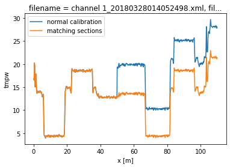

15. Calibration using matching sections
=======================================

In notebook 14 we showed how you can take splices or connectors within
your calibration into account. To then calibrate the cable we used
reference sections on both sides of the splice. If these are not
available, or in other cases where you have a lack of reference
sections, matching sections can be used to improve the calibration.

For matching sections you need two sections of fiber than you know will
be the exact same temperature. This can be, for example, in duplex
cables or twisted pairs of cable.

Demonstration
~~~~~~~~~~~~~

To demonstrate matching sections, we’ll load the same dataset that was
used in previous notebooks, and modify the data to simulate a lossy
splice, just as in notebook 14.

.. code:: ipython3

    import os
    
    from dtscalibration import read_silixa_files
    import matplotlib.pyplot as plt
    %matplotlib inline

.. code:: ipython3

    filepath = os.path.join('..', '..', 'tests', 'data', 'double_ended2')
    
    ds_ = read_silixa_files(
        directory=filepath,
        timezone_netcdf='UTC',
        file_ext='*.xml')
    
    ds = ds_.sel(x=slice(0, 110))  # only calibrate parts of the fiber
    
    
    sections = {
        'probe1Temperature': [slice(7.5, 17.)],  # cold bath
        'probe2Temperature': [slice(24., 34.)],  # warm bath
        }
    ds.sections = sections

.. parsed-literal::

    6 files were found, each representing a single timestep
    6 recorded vars were found: LAF, ST, AST, REV-ST, REV-AST, TMP
    Recorded at 1693 points along the cable
    The measurement is double ended
    Reading the data from disk

.. parsed-literal::

    /home/bart/git/travis_fix/python-dts-calibration/src/dtscalibration/io.py:1843: FutureWarning: Using .astype to convert from timezone-aware dtype to timezone-naive dtype is deprecated and will raise in a future version.  Use obj.tz_localize(None) or obj.tz_convert('UTC').tz_localize(None) instead
      'time', pd.DatetimeIndex(v).tz_convert(timezone_netcdf).astype(

Again, we introduce a step loss in the signal strength at x = 50 m. For
the forward channel, this means all data beyond 50 meters is reduced
with a ‘random’ factor. For the backward channel, this means all data up
to 50 meters is reduced with a ‘random’ factor.

.. code:: ipython3

    ds['st'] = ds.st.where(ds.x < 50, ds.st*.8)
    ds['ast'] = ds.ast.where(ds.x < 50, ds.ast*.82)
    
    ds['rst'] = ds.rst.where(ds.x > 50, ds.rst*.85)
    ds['rast'] = ds.rast.where(ds.x > 50, ds.rast*.81)

We will first run a calibration without adding the transient attenuation
location or matching sections. A big jump in the calibrated temperature
is visible at x = 50.

As all calibration sections are before 50 meters, the first 50 m will be
calibrated correctly.

.. code:: ipython3

    ds_a = ds.copy(deep=True)
    
    st_var, resid = ds_a.variance_stokes(st_label='st')
    ast_var, _ = ds_a.variance_stokes(st_label='ast')
    rst_var, _ = ds_a.variance_stokes(st_label='rst')
    rast_var, _ = ds_a.variance_stokes(st_label='rast')
    
    ds_a.calibration_double_ended(
        st_var=st_var,
        ast_var=ast_var,
        rst_var=rst_var,
        rast_var=rast_var,
        store_tmpw='tmpw',
        method='wls',
        solver='sparse')
    
    ds_a.isel(time=0).tmpw.plot(label='calibrated')

.. parsed-literal::

    [<matplotlib.lines.Line2D at 0x7f4a93d2e4f0>]

.. image:: 15Matching_sections.ipynb_files/15Matching_sections.ipynb_8_1.png

Now we run a calibration, adding the keyword argument ‘**trans_att**’,
and provide a list of floats containing the locations of the splices. In
this case we only add a single one at x = 50 m.

We will also define the matching sections of cable. The matching
sections have to be provided as a list of tuples. A tuple per matching
section. Each tuple has three items, the first two items are the slices
of the sections that are matching. The third item is a bool and is True
if the two sections have a reverse direction (as in the
“J-configuration”).

In this example we match the two cold baths to each other.

After running the calibration you will see that by adding the transient
attenuation and matching sections the calibration returns the correct
temperature, without the big jump.

*In single-ended calibration the keyword is called ‘**trans_att**’.*

.. code:: ipython3

    matching_sections = [
        (slice(7.5, 17.6), slice(69, 79.1), False)
    ]
    
    st_var, resid = ds.variance_stokes(st_label='st')
    ast_var, _ = ds.variance_stokes(st_label='ast')
    rst_var, _ = ds.variance_stokes(st_label='rst')
    rast_var, _ = ds.variance_stokes(st_label='rast')
    
    ds.calibration_double_ended(
        st_var=st_var,
        ast_var=ast_var,
        rst_var=rst_var,
        rast_var=rast_var,
        trans_att=[50.],
        matching_sections=matching_sections,
        store_tmpw='tmpw',
        method='wls',
        solver='sparse')
    
    ds_a.isel(time=0).tmpw.plot(label='normal calibration')
    ds.isel(time=0).tmpw.plot(label='matching sections')
    plt.legend()

.. parsed-literal::

    /home/bart/git/travis_fix/python-dts-calibration/.tox/docs/lib/python3.9/site-packages/scipy/sparse/_index.py:137: SparseEfficiencyWarning: Changing the sparsity structure of a csr_matrix is expensive. lil_matrix is more efficient.
      self._set_arrayXarray_sparse(i, j, x)

.. parsed-literal::

    <matplotlib.legend.Legend at 0x7f4a9171aa00>

