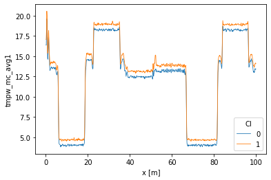
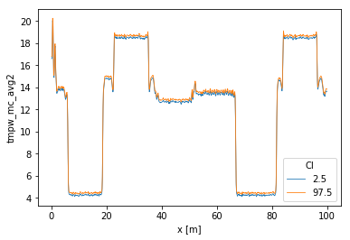
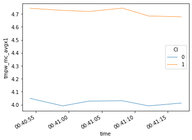

16. Confidence intervals of average temperatures
================================================

See Notebook 8 for a description of the calibration procedure. This
notebook is about the confidence intervals estimation using measurements
from a double ended setup.

Calibration procedure
---------------------

.. code:: ipython3

    import os
    
    from dtscalibration import read_silixa_files
    import matplotlib.pyplot as plt
    %matplotlib inline

.. code:: ipython3

    filepath = os.path.join('..', '..', 'tests', 'data', 'double_ended2')
    
    ds_ = read_silixa_files(
        directory=filepath,
        timezone_netcdf='UTC',
        file_ext='*.xml')
    
    ds = ds_.sel(x=slice(0, 100))  # only calibrate parts of the fiber
    sections = {
        'probe1Temperature': [slice(7.5, 17.), slice(70., 80.)],  # cold bath
        'probe2Temperature': [slice(24., 34.), slice(85., 95.)],  # warm bath
        }
    ds.sections = sections

.. parsed-literal::

    6 files were found, each representing a single timestep
    6 recorded vars were found: LAF, ST, AST, REV-ST, REV-AST, TMP
    Recorded at 1693 points along the cable
    The measurement is double ended
    Reading the data from disk

.. parsed-literal::

    /home/bart/git/travis_fix/python-dts-calibration/src/dtscalibration/io.py:1843: FutureWarning: Using .astype to convert from timezone-aware dtype to timezone-naive dtype is deprecated and will raise in a future version.  Use obj.tz_localize(None) or obj.tz_convert('UTC').tz_localize(None) instead
      'time', pd.DatetimeIndex(v).tz_convert(timezone_netcdf).astype(

.. code:: ipython3

    st_var, resid = ds.variance_stokes(st_label='st')
    ast_var, _ = ds.variance_stokes(st_label='ast')
    rst_var, _ = ds.variance_stokes(st_label='rst')
    rast_var, _ = ds.variance_stokes(st_label='rast')

.. code:: ipython3

    ds.calibration_double_ended(
        st_var=st_var,
        ast_var=ast_var,
        rst_var=rst_var,
        rast_var=rast_var,
        store_tmpw='tmpw',
        method='wls',
        solver='sparse')

Confidence intervals of averages
--------------------------------

Introduction confidence intervals
~~~~~~~~~~~~~~~~~~~~~~~~~~~~~~~~~

The confidence intervals consist of two sources of uncertainty.

1. Measurement noise in the measured Stokes and anti-Stokes signals.
   Expressed in a single variance value.
2. Inherent to least squares procedures / overdetermined systems, the
   parameters are estimated with limited certainty and all parameters
   are correlated. Which is expressed in the covariance matrix.

Both sources of uncertainty are propagated to an uncertainty in the
estimated temperature via Monte Carlo.

Confidence intervals are all computed with
``ds.conf_int_double_ended()`` and ``ds.conf_int_single_ended()``. The
confidence interval can be estimated if the calibration method is
``wls`` (so that the parameter uncertainties are estimated), ``st_var``,
``ast_var``, ``rst_var``, ``rast_var`` are correctly estimated, and
confidence intervals are passed to ``conf_ints``. As weigths are
correctly passed to the least squares procedure, the covariance matrix
can be used as an estimator for the uncertainty in the parameters. This
matrix holds the covariances between all the parameters. A large
parameter set is generated from this matrix as part of the Monte Carlo
routine, assuming the parameter space is normally distributed with their
mean at the best estimate of the least squares procedure.

The large parameter set is used to calculate a large set of
temperatures. By using ``percentiles`` or ``quantile`` the 95%
confidence interval of the calibrated temperature between 2.5% and 97.5%
are calculated.

Four types of averaging schemes are implemented: 1. Averaging over time
while the temperature varies over time and along the fiber 2. Averaging
over time while assuming the temperature remains constant over time but
varies along the fiber 3. Averaging along the fiber while the
temperature varies along the cable and over time 4. Averaging along the
fiber while assuming the temperature is same along the fiber but varies
over time

These functions only work with the same size DataStore as that was
calibrated. If you would like to average only a selection use the
keyword arguments ``ci_avg_time_sel``, ``ci_avg_time_isel``,
``ci_avg_x_sel``, ``ci_avg_x_isel``.

1. Averaging over time while the temperature varies over time and along the fiber
~~~~~~~~~~~~~~~~~~~~~~~~~~~~~~~~~~~~~~~~~~~~~~~~~~~~~~~~~~~~~~~~~~~~~~~~~~~~~~~~~

So that you can state: - ‘We can say with 95% confidence that the
temperature remained between this line and this line during the entire
measurement period’. - The average temperature during the measurement
period was ..

Using the default ``store_..`` values the following DataArrays are added
to the DataStore:

::

   tmpf_avg1              The average forward temperature
   tmpf_mc_avg1_var       The estimated variance of the average forward temperature
   tmpf_mc_avg1           The confidence intervals of the average forward temperature

   tmpb_avg1              The average backward temperature
   tmpb_mc_avg1_var       The estimated variance of the average backward temperature
   tmpb_mc_avg1           The confidence intervals of the average forward temperature

   tmpw_avg1              The average forward-backward-averaged temperature
   tmpw_avg1_var          The estimated variance of the average forward-backward-averaged temperature
   tmpw_mc_avg1           The confidence intervals of the average forward-backward-averaged temperature

.. code:: ipython3

    ds.average_double_ended(
        st_var=st_var,
        ast_var=ast_var,
        rst_var=rst_var,
        rast_var=rast_var,
        conf_ints=[2.5, 97.5],
        mc_sample_size=500,  # <- choose a much larger sample size
        ci_avg_time_flag1=True,
        ci_avg_time_flag2=False,
        ci_avg_time_isel=[0, 1, 2, 3, 4, 5],
        ci_avg_time_sel=None)
    ds.tmpw_mc_avg1.plot(hue='CI', linewidth=0.8);

2. Averaging over time while assuming the temperature remains constant over time but varies along the fiber
~~~~~~~~~~~~~~~~~~~~~~~~~~~~~~~~~~~~~~~~~~~~~~~~~~~~~~~~~~~~~~~~~~~~~~~~~~~~~~~~~~~~~~~~~~~~~~~~~~~~~~~~~~~

So that you can state: - ‘I want to estimate a background temperature
with confidence intervals. I hereby assume the temperature does not
change over time and average all measurements to get a better estimate
of the background temperature.’

Using the default ``store_..`` values the following DataArrays are added
to the DataStore:

::

   tmpf_avg2              The average forward temperature
   tmpf_mc_avg2_var       The estimated variance of the average forward temperature
   tmpf_mc_avg2           The confidence intervals of the average forward temperature

   tmpb_avg2              The average backward temperature
   tmpb_mc_avg2_var       The estimated variance of the average backward temperature
   tmpb_mc_avg2           The confidence intervals of the average forward temperature

   tmpw_avg2              The average forward-backward-averaged temperature
   tmpw_avg2_var          The estimated variance of the average forward-backward-averaged temperature
   tmpw_mc_avg2           The confidence intervals of the average forward-backward-averaged temperature

Note that this average has much less uncertainty that averaging option
1. We can specify specific times with ``ci_avg_time_isel``.

.. code:: ipython3

    ds.average_double_ended(
        st_var=st_var,
        ast_var=ast_var,
        rst_var=rst_var,
        rast_var=rast_var,
        conf_ints=[2.5, 97.5],
        mc_sample_size=500,  # <- choose a much larger sample size
        ci_avg_time_flag1=False,
        ci_avg_time_flag2=True,
        ci_avg_time_isel=[0, 1, 2, 3, 4, 5],
        ci_avg_time_sel=None)
    ds.tmpw_mc_avg2.plot(hue='CI', linewidth=0.8);

3. Averaging along the fiber while the temperature varies along the cable and over time
~~~~~~~~~~~~~~~~~~~~~~~~~~~~~~~~~~~~~~~~~~~~~~~~~~~~~~~~~~~~~~~~~~~~~~~~~~~~~~~~~~~~~~~

So that you can state: - ‘The temperature of the fiber remained between
these ci bounds at time 2, and at time 3 the temperature of the fiber
remained between these ci bounds’.

Using the default ``store_..`` values the following DataArrays are added
to the DataStore:

::

   tmpf_avgx1              The average forward temperature
   tmpf_mc_avgx1_var       The estimated variance of the average forward temperature
   tmpf_mc_avgx1           The confidence intervals of the average forward temperature

   tmpb_avgx1              The average backward temperature
   tmpb_mc_avgx1_var       The estimated variance of the average backward temperature
   tmpb_mc_avgx1           The confidence intervals of the average forward temperature

   tmpw_avgx1              The average forward-backward-averaged temperature
   tmpw_avgx1_var          The estimated variance of the average forward-backward-averaged temperature
   tmpw_mc_avgx1           The confidence intervals of the average forward-backward-averaged temperature

Note that this function returns a single average per time step. Use the
keyword arguments ``ci_avg_x_sel``, ``ci_avg_x_isel`` to specify
specific fiber sections.

.. code:: ipython3

    ds.average_double_ended(
        st_var=st_var,
        ast_var=ast_var,
        rst_var=rst_var,
        rast_var=rast_var,
        conf_ints=[2.5, 97.5],
        mc_sample_size=500,  # <- choose a much larger sample size
        ci_avg_x_flag1=True,
        ci_avg_x_flag2=False,
        ci_avg_x_sel=slice(7.5, 17.),
        ci_avg_x_isel=None)
    ds.tmpw_mc_avgx1.plot(hue='CI', linewidth=0.8);

4. Averaging along the fiber while assuming the temperature is same along the fiber but varies over time
~~~~~~~~~~~~~~~~~~~~~~~~~~~~~~~~~~~~~~~~~~~~~~~~~~~~~~~~~~~~~~~~~~~~~~~~~~~~~~~~~~~~~~~~~~~~~~~~~~~~~~~~

So that you can state: - ‘I have put a lot of fiber in water, and I know
that the temperature variation in the water is much smaller than along
other parts of the fiber. And I would like to average the measurements
from multiple locations to improve the estimated temperature of the
water’.

Using the default ``store_..`` values the following DataArrays are added
to the DataStore:

::

   tmpf_avgx2              The average forward temperature
   tmpf_mc_avgx2_var       The estimated variance of the average forward temperature
   tmpf_mc_avgx2           The confidence intervals of the average forward temperature

   tmpb_avgx2              The average backward temperature
   tmpb_mc_avgx2_var       The estimated variance of the average backward temperature
   tmpb_mc_avgx2           The confidence intervals of the average forward temperature

   tmpw_avgx2              The average forward-backward-averaged temperature
   tmpw_avgx2_var          The estimated variance of the average forward-backward-averaged temperature
   tmpw_mc_avgx2           The confidence intervals of the average forward-backward-averaged temperature

Select the part of the fiber that is in the water with ``ci_avg_x_sel``.

.. code:: ipython3

    ds.average_double_ended(
        st_var=st_var,
        ast_var=ast_var,
        rst_var=rst_var,
        rast_var=rast_var,
        conf_ints=[2.5, 97.5],
        mc_sample_size=500,  # <- choose a much larger sample size
        ci_avg_x_flag1=False,
        ci_avg_x_flag2=True,
        ci_avg_x_sel=slice(7.5, 17.),
        ci_avg_x_isel=None)
    ds.tmpw_mc_avgx2.plot(hue='CI', linewidth=0.8);

.. image:: 16Averaging_temperatures.ipynb_files/16Averaging_temperatures.ipynb_19_0.png

